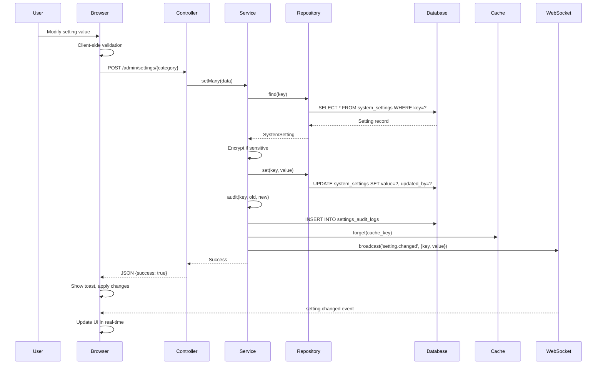
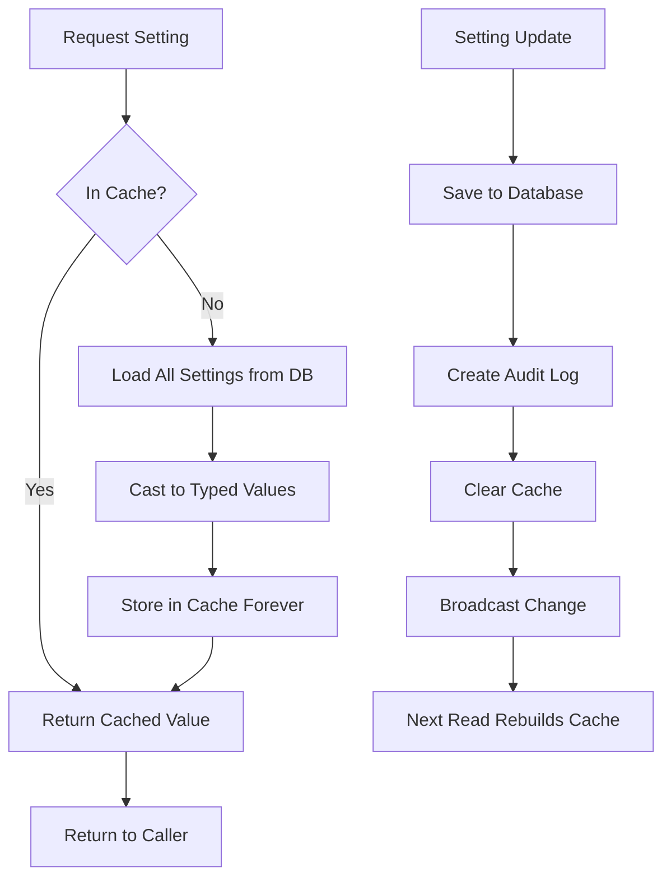
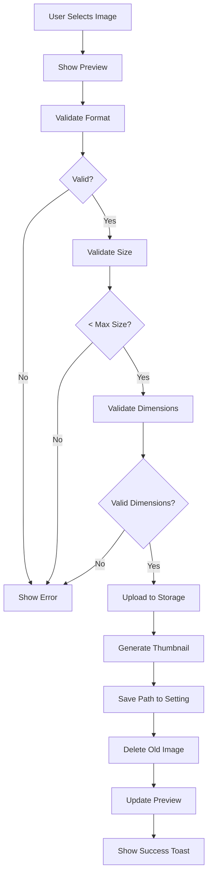

# Design Document: Enterprise System Settings Module

## Overview

The Enterprise System Settings Module transforms the existing static Laravel ERP settings UI into a production-ready configuration center with full CRUD capabilities, real-time validation, audit logging, and immediate system-wide application of changes. The design leverages the existing `system_settings` table, `SystemSetting` model, `SettingsService`, and `Setting` facade, extending them to support 20 setting categories encompassing all aspects of ERP configuration.

The architecture follows Laravel best practices with a layered approach: Controllers handle HTTP requests, Services contain business logic, Repositories abstract data access, and Models represent database entities. Settings are cached for performance, encrypted for security, validated on input, and logged for compliance.

Key design decisions:
- **AJAX-first approach**: All setting saves use asynchronous requests for modern UX
- **Cache-aside pattern**: Settings loaded from cache, invalidated on write
- **Encryption at rest**: Sensitive values encrypted using Laravel's Crypt facade
- **Audit trail**: Every change logged with user, timestamp, IP, and old/new values
- **Real-time updates**: WebSocket broadcasting for immediate multi-session updates
- **Conditional rendering**: Settings visibility based on dependencies and permissions
- **Type-safe casting**: Database strings cast to proper PHP types on retrieval

## Architecture

### Layered Architecture

```
┌─────────────────────────────────────────────────────────────┐
│                     Presentation Layer                       │
│  - Blade Templates (settings forms with Vue.js components)  │
│  - AJAX Controllers (JSON API endpoints)                    │
│  - Toast Notifications, Loading States, Validation Messages │
└───────────────────────┬─────────────────────────────────────┘
                        │
┌───────────────────────▼─────────────────────────────────────┐
│                      Service Layer                           │
│  - SettingsService (CRUD, caching, validation)              │
│  - AuditService (change tracking)                           │
│  - BackupService (backup/restore operations)                │
│  - IntegrationTestService (test external connections)       │
└───────────────────────┬─────────────────────────────────────┘
                        │
┌───────────────────────▼─────────────────────────────────────┐
│                    Repository Layer                          │
│  - SettingsRepository (database queries)                    │
│  - AuditRepository (log queries)                            │
└───────────────────────┬─────────────────────────────────────┘
                        │
┌───────────────────────▼─────────────────────────────────────┐
│                       Data Layer                             │
│  - SystemSetting Model                                      │
│  - SettingsAuditLog Model                                   │
│  - system_settings table                                    │
│  - settings_audit_logs table                                │
└─────────────────────────────────────────────────────────────┘
```

### Request Flow

1. **User interaction**: User modifies setting in UI
2. **Client-side validation**: Vue.js validates input format
3. **AJAX request**: Form data POSTed to controller endpoint
4. **Server-side validation**: Laravel validates against rules
5. **Service processing**: SettingsService encrypts sensitive data, updates database
6. **Audit logging**: AuditService records change
7. **Cache invalidation**: Settings cache cleared
8. **WebSocket broadcast**: Change event sent to all sessions
9. **JSON response**: Success/error returned to client
10. **UI update**: Toast notification, form state reset, visual changes applied


## Components and Interfaces

### Backend Components

#### SettingsController

Handles HTTP requests for settings operations.

```php
class SettingsController extends Controller
{
    public function __construct(
        private SettingsService $settingsService,
        private AuditService $auditService
    ) {}
    
    // Display settings page for a category
    public function index(string $category): View
    
    // Get settings for a category as JSON (for AJAX loading)
    public function show(string $category): JsonResponse
    
    // Save multiple settings
    public function update(SettingsRequest $request, string $category): JsonResponse
    
    // Restore category defaults
    public function restoreDefaults(string $category): JsonResponse
    
    // Export settings to JSON file
    public function export(): JsonResponse
    
    // Import settings from JSON file
    public function import(Request $request): JsonResponse
    
    // Search settings
    public function search(Request $request): JsonResponse
}
```

#### SettingsService (Enhanced)

Core business logic for settings management. Extends existing service.

```php
class SettingsService
{
    // Existing methods (get, set, group, all, setMany, clearCache, etc.)
    
    // New methods for enhanced functionality:
    
    // Validate setting value against rules before save
    public function validate(string $key, mixed $value): array
    
    // Get settings grouped by category and section
    public function getCategorizedSettings(string $category): Collection
    
    // Apply appearance settings as CSS variables
    public function generateCssVariables(): string
    
    // Test email configuration
    public function testEmailConfig(array $config, string $testRecipient): bool
    
    // Test storage connection
    public function testStorageConnection(string $driver, array $config): bool
    
    // Test third-party integration
    public function testIntegration(string $integration, array $credentials): bool
    
    // Get settings diff between current and defaults
    public function getDiff(string $category): array
    
    // Broadcast setting change via WebSocket
    private function broadcastChange(string $key, mixed $value): void
}
```

#### BackupService

Handles backup and restore operations.

```php
class BackupService
{
    // Create full system backup (database + files)
    public function create(): Backup
    
    // List all available backups
    public function list(): Collection
    
    // Download backup file
    public function download(string $filename): StreamedResponse
    
    // Restore from backup
    public function restore(string $filename): bool
    
    // Delete backup file
    public function delete(string $filename): bool
    
    // Get backup file size and metadata
    public function getMetadata(string $filename): array
    
    // Create pre-restore backup automatically
    private function createPreRestoreBackup(): void
}
```

#### AuditService

Manages audit logging and retrieval.

```php
class AuditService
{
    // Log a setting change
    public function log(string $key, mixed $oldValue, mixed $newValue): SettingsAuditLog
    
    // Get audit logs for a setting key
    public function getForKey(string $key, int $limit = 50): Collection
    
    // Get recent audit logs
    public function getRecent(int $days = 30): Collection
    
    // Search audit logs
    public function search(array $filters): Collection
    
    // Get audit logs for a user
    public function getByUser(int $userId): Collection
    
    // Export audit logs to CSV
    public function exportCsv(array $filters): string
}
```

#### SettingsRepository (Enhanced)

Data access layer for settings. Extends existing repository.

```php
class SettingsRepository
{
    // Existing methods (find, getByCategory, getAllAsKeyValue, set, etc.)
    
    // New methods:
    
    // Get settings with their dependencies resolved
    public function getWithDependencies(string $category): Collection
    
    // Bulk update multiple settings in transaction
    public function bulkUpdate(array $settings): bool
    
    // Get settings by section within category
    public function getBySection(string $category, string $section): Collection
    
    // Check if setting is editable by current user
    public function isEditable(string $key): bool
    
    // Get default value for a setting
    public function getDefault(string $key): mixed
}
```


### Frontend Components

#### SettingsForm Vue Component

Main settings form with AJAX submission, validation, and conditional fields.

```typescript
interface SettingsFormProps {
  category: string;
  section?: string;
  settings: Setting[];
}

interface Setting {
  key: string;
  value: any;
  type: string;
  input_type: string;
  label: string;
  description?: string;
  options?: Array<{label: string, value: any}>;
  validation_rules?: string;
  depends_on?: string;
  is_sensitive: boolean;
  is_editable: boolean;
}

class SettingsForm {
  // Data
  settings: Setting[];
  originalValues: Record<string, any>;
  errors: Record<string, string>;
  loading: boolean;
  hasUnsavedChanges: boolean;
  
  // Methods
  async loadSettings(): Promise<void>;
  validateField(key: string, value: any): string | null;
  async saveSettings(): Promise<void>;
  async restoreDefaults(): Promise<void>;
  checkDependency(setting: Setting): boolean;
  handleBeforeUnload(event: BeforeUnloadEvent): void;
  showToast(message: string, type: 'success' | 'error'): void;
}
```

#### ImageUpload Vue Component

Image upload with preview, validation, and drag-and-drop.

```typescript
interface ImageUploadProps {
  modelValue: string | null;
  label: string;
  maxSize: number; // in MB
  dimensions?: { width: number; height: number };
  acceptedFormats: string[];
}

class ImageUpload {
  // Data
  imageUrl: string | null;
  previewUrl: string | null;
  uploading: boolean;
  dragOver: boolean;
  
  // Methods
  handleFileSelect(file: File): void;
  handleDragOver(event: DragEvent): void;
  handleDrop(event: DragEvent): void;
  validateImage(file: File): string | null;
  async uploadImage(file: File): Promise<string>;
  removeImage(): void;
  showPreview(file: File): void;
}
```

#### ColorPicker Vue Component

Color picker with real-time CSS variable generation.

```typescript
interface ColorPickerProps {
  modelValue: string;
  label: string;
  generateVariables: boolean;
}

class ColorPicker {
  // Data
  color: string;
  showPicker: boolean;
  
  // Methods
  updateColor(newColor: string): void;
  generateCssVariables(baseColor: string): Record<string, string>;
  applyVariables(variables: Record<string, string>): void;
}
```

#### ToastNotification Component

Toast notification system for user feedback.

```typescript
interface Toast {
  id: string;
  message: string;
  type: 'success' | 'error' | 'warning' | 'info';
  duration: number;
}

class ToastManager {
  toasts: Toast[];
  
  show(message: string, type: Toast['type'], duration: number = 3000): void;
  hide(id: string): void;
  clear(): void;
}
```

### API Endpoints

```
GET    /admin/settings/{category}              - Show settings page
GET    /admin/settings/{category}/json         - Get settings as JSON
POST   /admin/settings/{category}              - Save settings
POST   /admin/settings/{category}/restore      - Restore defaults
GET    /admin/settings/export                  - Export settings
POST   /admin/settings/import                  - Import settings
GET    /admin/settings/search                  - Search settings
POST   /admin/settings/test-email              - Test email config
POST   /admin/settings/test-storage            - Test storage connection
POST   /admin/settings/test-integration/{name} - Test integration
GET    /admin/backups                          - List backups
POST   /admin/backups/create                   - Create backup
GET    /admin/backups/{filename}/download      - Download backup
POST   /admin/backups/{filename}/restore       - Restore backup
DELETE /admin/backups/{filename}               - Delete backup
GET    /admin/audit-logs                       - View audit logs
GET    /admin/audit-logs/export                - Export audit logs
GET    /admin/system-info                      - View system information
POST   /admin/maintenance/enable               - Enable maintenance mode
POST   /admin/maintenance/disable              - Disable maintenance mode
POST   /admin/cache/clear                      - Clear all caches
POST   /admin/queue/restart                    - Restart queue workers
GET    /admin/logs                             - List log files
GET    /admin/logs/{filename}                  - View log file
DELETE /admin/logs/{filename}                  - Clear log file
```


## Data Models

### SystemSetting Model (Existing - Enhanced)

The existing `SystemSetting` model requires no schema changes but receives additional methods:

```php
class SystemSetting extends Model
{
    // Existing properties and methods remain unchanged
    
    // New computed property for dependency checking
    public function getDependencyMetAttribute(): ?array
    {
        if (!$this->depends_on) {
            return null;
        }
        
        [$key, $expectedValue] = explode(':', $this->depends_on);
        return ['key' => $key, 'value' => $expectedValue];
    }
    
    // New method to check if dependency is satisfied
    public function isDependencySatisfied(): bool
    {
        if (!$this->depends_on) {
            return true;
        }
        
        $dep = $this->dependency_met;
        $actualValue = Setting::get($dep['key']);
        
        return $actualValue == $dep['value'];
    }
    
    // New scope for visible settings based on dependencies
    public function scopeVisible($query)
    {
        return $query->where(function($q) {
            $q->whereNull('depends_on')
              ->orWhereIn('id', function($subquery) {
                  // Complex subquery to filter by satisfied dependencies
                  // Implementation depends on database optimization
              });
        });
    }
}
```

### SettingsAuditLog Model (Existing - No Changes)

The existing `SettingsAuditLog` model is sufficient for audit requirements. No modifications needed.

### Backup Model (New)

Represents a system backup for metadata tracking.

```php
class Backup extends Model
{
    protected $table = 'backups';
    
    protected $fillable = [
        'filename',
        'path',
        'size',
        'type',  // 'manual', 'scheduled', 'pre-restore'
        'includes_database',
        'includes_files',
        'created_by',
        'created_at',
    ];
    
    protected $casts = [
        'size' => 'integer',
        'includes_database' => 'boolean',
        'includes_files' => 'boolean',
        'created_at' => 'datetime',
    ];
    
    public function creator(): BelongsTo
    {
        return $this->belongsTo(User::class, 'created_by');
    }
    
    public function getFormattedSizeAttribute(): string
    {
        return $this->formatBytes($this->size);
    }
    
    private function formatBytes(int $bytes): string
    {
        $units = ['B', 'KB', 'MB', 'GB', 'TB'];
        $bytes = max($bytes, 0);
        $pow = floor(($bytes ? log($bytes) : 0) / log(1024));
        $pow = min($pow, count($units) - 1);
        $bytes /= (1 << (10 * $pow));
        
        return round($bytes, 2) . ' ' . $units[$pow];
    }
}
```

### Migration for Backups Table

```php
Schema::create('backups', function (Blueprint $table) {
    $table->id();
    $table->string('filename')->unique();
    $table->string('path');
    $table->unsignedBigInteger('size');
    $table->enum('type', ['manual', 'scheduled', 'pre-restore'])->default('manual');
    $table->boolean('includes_database')->default(true);
    $table->boolean('includes_files')->default(true);
    $table->unsignedBigInteger('created_by');
    $table->timestamp('created_at');
    
    $table->foreign('created_by')->references('id')->on('users')->cascadeOnDelete();
    $table->index('created_at');
});
```


### Settings Seeder Structure

Settings are seeded into the database using a structured seeder. Example for appearance settings:

```php
private function seedAppearanceSettings(): void
{
    $settings = [
        // Colors
        [
            'category' => 'appearance',
            'section' => 'colors',
            'key' => 'appearance.colors.primary',
            'value' => '#4e73df',
            'type' => 'string',
            'input_type' => 'color',
            'label' => 'Primary Color',
            'description' => 'Main brand color used throughout the application',
            'validation_rules' => 'required|regex:/^#[0-9A-Fa-f]{6}$/',
            'default_value' => '#4e73df',
            'is_public' => true,
            'is_editable' => true,
            'sort_order' => 10,
        ],
        // Theme
        [
            'category' => 'appearance',
            'section' => 'theme',
            'key' => 'appearance.theme.mode',
            'value' => 'light',
            'type' => 'string',
            'input_type' => 'select',
            'label' => 'Theme Mode',
            'description' => 'Choose between light, dark, or automatic theme',
            'options' => [
                ['label' => 'Light', 'value' => 'light'],
                ['label' => 'Dark', 'value' => 'dark'],
                ['label' => 'Auto (System)', 'value' => 'auto'],
            ],
            'validation_rules' => 'required|in:light,dark,auto',
            'default_value' => 'light',
            'is_public' => true,
            'is_editable' => true,
            'sort_order' => 20,
        ],
        // Logos
        [
            'category' => 'appearance',
            'section' => 'branding',
            'key' => 'appearance.branding.logo',
            'value' => null,
            'type' => 'image',
            'input_type' => 'image',
            'label' => 'Primary Logo',
            'description' => 'Main logo displayed in the header (recommended: 200x50px)',
            'validation_rules' => 'nullable|image|max:2048|mimes:png,jpg,svg',
            'default_value' => null,
            'is_public' => true,
            'is_editable' => true,
            'sort_order' => 30,
        ],
    ];
    
    foreach ($settings as $setting) {
        SystemSetting::updateOrCreate(
            ['key' => $setting['key']],
            $setting
        );
    }
}
```

## Data Flow Diagrams

### Setting Update Flow




### Cache Strategy Flow



### Image Upload Flow




## Correctness Properties

*A property is a characteristic or behavior that should hold true across all valid executions of a system—essentially, a formal statement about what the system should do. Properties serve as the bridge between human-readable specifications and machine-verifiable correctness guarantees.*

### Property Reflection

After analyzing all acceptance criteria, the following properties were identified. During property reflection, several redundancies were eliminated:

- Properties about saving individual settings vs. batch settings were combined into comprehensive save properties
- Properties about different sensitive setting types (passwords, API keys, credentials) were consolidated into a single encryption property
- Properties about various conditional field types were unified into a dependency resolution property
- Properties about different validation types were combined into a general validation property
- Properties about UI state (loading, errors, toasts) were identified as examples rather than universal properties

The following properties provide comprehensive coverage without redundancy:

### Core Settings Engine Properties

**Property 1: Settings Persistence**

*For any* setting modification (single or batch), when saved through the Settings_Engine, querying the database SHALL return the saved value, with `updated_at` timestamp updated and `updated_by` set to the current user.

**Validates: Requirements 1.1, 1.2**

**Property 2: Sensitive Data Encryption Round-Trip**

*For any* setting marked as `is_sensitive`, saving a value then retrieving it SHALL return the original unencrypted value, while the raw database storage SHALL contain only the encrypted version.

**Validates: Requirements 1.3, 1.4, 11.2, 13.5**

**Property 3: Transactional Batch Updates**

*For any* batch of setting updates where at least one setting fails validation, no settings in the batch SHALL be persisted to the database (all-or-nothing transaction behavior).

**Validates: Requirements 1.5**

**Property 4: Validation Rule Enforcement**

*For any* setting with a non-empty `validation_rules` field, attempting to save a value that violates those rules SHALL be rejected with an appropriate error message, and the invalid value SHALL NOT be persisted.

**Validates: Requirements 3.1, 3.4, 3.5, 7.5**

**Property 5: Audit Logging Completeness**

*For any* setting value change, an audit log entry SHALL be created containing the setting key, old value, new value, user ID, IP address, user agent, browser, device, and timestamp.

**Validates: Requirements 4.1, 4.2**

**Property 6: Sensitive Audit Log Masking**

*For any* setting marked as `is_sensitive`, the audit log SHALL record that a change occurred, but the `old_value` and `new_value` fields SHALL contain masked values (e.g., "••••••••") rather than plaintext sensitive data.

**Validates: Requirements 4.3**

**Property 7: Audit Log Chronological Ordering**

*For any* sequence of setting changes, retrieving audit logs SHALL return them in chronological order (oldest to newest or newest to oldest) based on the `changed_at` timestamp.

**Validates: Requirements 4.4**

**Property 8: Audit Log Filtering**

*For any* combination of filters (setting key, user ID, date range, IP address), the audit log query SHALL return only records matching ALL specified filters.

**Validates: Requirements 4.5**


### Cache Management Properties

**Property 9: Cache Invalidation on Write**

*For any* setting update operation, the settings cache SHALL be cleared, ensuring the next read operation retrieves fresh data from the database.

**Validates: Requirements 5.2**

**Property 10: Cache Regeneration on Read**

*For any* setting read operation when the cache is empty, the Settings_Engine SHALL load all settings from the database and populate the cache before returning the requested value.

**Validates: Requirements 5.1, 5.3**

### Image Upload Properties

**Property 11: Image Validation Enforcement**

*For any* image upload, if the file fails validation (invalid format, exceeds size limit, or has incorrect dimensions), the upload SHALL be rejected with a specific error message and the setting value SHALL remain unchanged.

**Validates: Requirements 8.4, 30.4**

**Property 12: Image Storage Path Integrity**

*For any* successful image upload for a setting, the setting value SHALL contain a valid storage path, and accessing that path SHALL return the uploaded image file.

**Validates: Requirements 30.5**

### Appearance and CSS Properties

**Property 13: CSS Variable Generation from Colors**

*For any* appearance color setting (primary, secondary, success, warning, danger, info), saving a valid hex color SHALL generate corresponding CSS variables including base color and shade variations (lighter, light, dark, darker).

**Validates: Requirements 8.2, 32.1, 32.4, 32.5**

**Property 14: Date Format Preview Consistency**

*For any* valid date format string, the preview generation function SHALL produce a formatted date string that, when parsed using the same format, yields the original date.

**Validates: Requirements 6.5, 10.4**

### Conditional Visibility Properties

**Property 15: Dependency Resolution**

*For any* setting with a `depends_on` value in format "key:expected_value", the setting SHALL be marked as visible if and only if the referenced key's current value equals the expected value.

**Validates: Requirements 11.6, 12.2, 12.3, 12.4, 12.5, 13.2, 13.3, 13.4, 33.2, 33.3, 33.4**

### Backup and Restore Properties

**Property 16: Backup File Creation**

*For any* backup creation request, a backup archive SHALL be generated containing database dump and files, stored with a unique timestamped filename, and a corresponding record SHALL be created in the backups table with correct metadata (filename, size, type, timestamps).

**Validates: Requirements 14.1, 14.2**

**Property 17: Backup Listing Completeness**

*For any* backup files stored in the backups directory, querying the backup list SHALL return all backup records with accurate metadata matching the actual files on disk.

**Validates: Requirements 14.3**

**Property 18: Pre-Restore Backup Creation**

*For any* backup restore operation, a new backup of type 'pre-restore' SHALL be automatically created before applying the restore, ensuring the current state is preserved.

**Validates: Requirements 14.7**

**Property 19: Backup Operation Error Handling**

*For any* backup operation (create, restore, delete) that encounters an error, the error SHALL be logged, the operation SHALL be rolled back to a consistent state, and an error message SHALL be returned to the caller.

**Validates: Requirements 14.9**


### Security and Access Control Properties

**Property 20: Password Policy Application**

*For any* password validation request, if password policy settings (minimum length, character requirements) are configured, the validation SHALL enforce those requirements and reject non-compliant passwords.

**Validates: Requirements 9.4, 15.1**

**Property 21: IP Whitelist Enforcement**

*For any* request to the settings interface when IP_Whitelist is populated with at least one entry, if the request IP address is not in the whitelist, the request SHALL be blocked with a 403 Forbidden response.

**Validates: Requirements 15.5**

**Property 22: IP Blacklist Enforcement**

*For any* request to the settings interface when IP_Blacklist is populated with at least one entry, if the request IP address is in the blacklist, the request SHALL be blocked with a 403 Forbidden response.

**Validates: Requirements 15.6**

### Module Management Properties

**Property 23: Module State Propagation**

*For any* module toggle change (enable to disable or disable to enable), the change SHALL be reflected in the module status and affect route registration and menu visibility for subsequent requests.

**Validates: Requirements 16.2, 16.3, 16.4**

### Settings Export and Import Properties

**Property 24: Export Excludes Sensitive Data**

*For any* settings export operation, the generated JSON SHALL contain only settings where `is_sensitive = false`, ensuring passwords, API keys, and other sensitive values are never exported.

**Validates: Requirements 31.2**

**Property 25: Import Validates Structure**

*For any* settings import operation with invalid JSON structure or containing keys that don't exist in the database, the import SHALL fail with validation errors before making any database changes.

**Validates: Requirements 31.4, 31.7**

**Property 26: Import Respects Editability**

*For any* setting in an import file, if the setting exists in the database but `is_editable = false` or `is_sensitive = true`, that setting SHALL be skipped during import and included in the skipped count.

**Validates: Requirements 31.5**

**Property 27: Timezone Application to Datetime Displays**

*For any* datetime value displayed in the UI, changing the system timezone setting SHALL cause that datetime to be reformatted to the new timezone on the next page render.

**Validates: Requirements 6.2**

**Property 28: Currency Format Application**

*For any* monetary value displayed in the UI, the formatting (currency symbol, decimal places, thousands separator) SHALL match the currently configured currency setting.

**Validates: Requirements 6.4**


## Error Handling

### Validation Errors

All validation errors follow a consistent structure:

```php
{
    "success": false,
    "message": "Validation failed",
    "errors": {
        "appearance.colors.primary": ["The primary color must be a valid hex color."],
        "email.smtp.port": ["The port must be between 1 and 65535."]
    }
}
```

Error messages are:
- **Field-specific**: Each error tied to a specific setting key
- **Human-readable**: Clear explanation of what's wrong
- **Actionable**: User knows how to fix the issue

### Database Errors

Database operations are wrapped in try-catch blocks with transaction rollback:

```php
try {
    DB::beginTransaction();
    
    // Multiple setting updates
    foreach ($settings as $key => $value) {
        $this->settingsRepo->set($key, $value);
    }
    
    DB::commit();
} catch (\Exception $e) {
    DB::rollBack();
    
    Log::error('Settings save failed', [
        'error' => $e->getMessage(),
        'user' => auth()->id(),
        'settings' => array_keys($settings),
    ]);
    
    return response()->json([
        'success' => false,
        'message' => 'Failed to save settings. Please try again.',
    ], 500);
}
```

### File Upload Errors

Image uploads can fail for multiple reasons:

- **Invalid format**: "Only JPG, PNG, and SVG images are allowed"
- **File too large**: "Image must be smaller than 2MB"
- **Invalid dimensions**: "Logo must be 200x50 pixels or smaller"
- **Storage failure**: "Failed to upload image. Please check storage configuration"

### External Service Errors

When testing external integrations (email, storage, APIs):

```php
try {
    $result = $this->testSmtpConnection($config);
    
    return response()->json([
        'success' => true,
        'message' => 'Connection successful. Test email sent.',
    ]);
} catch (Swift_TransportException $e) {
    Log::warning('SMTP test failed', [
        'error' => $e->getMessage(),
        'config' => $this->maskSensitiveData($config),
    ]);
    
    return response()->json([
        'success' => false,
        'message' => 'SMTP connection failed: ' . $e->getMessage(),
    ], 400);
}
```

### Cache Errors

Cache operations are non-blocking. If cache fails, fall back to database:

```php
try {
    Cache::forget(self::CACHE_KEY);
} catch (\Exception $e) {
    // Log but don't fail the request
    Log::warning('Cache clear failed', ['error' => $e->getMessage()]);
}
```

### Permission Errors

Unauthorized access returns consistent 403 response:

```php
if (!auth()->user()->can('manage_system_settings')) {
    abort(403, 'You do not have permission to manage system settings.');
}
```

### Audit Log Errors

Audit logging never blocks setting saves. If audit fails, log the error but continue:

```php
try {
    SettingsAuditLog::record($key, $oldValue, $newValue, $requestId);
} catch (\Throwable $e) {
    Log::error('Audit log failed', [
        'error' => $e->getMessage(),
        'key' => $key,
    ]);
    // Continue execution - don't fail the save
}
```


## Testing Strategy

### Dual Testing Approach

This module requires both **unit tests** and **property-based tests** for comprehensive coverage:

- **Unit tests** validate specific examples, edge cases, UI interactions, and error conditions
- **Property-based tests** verify universal properties across all inputs through randomization
- Together they provide defense in depth: unit tests catch concrete bugs, property tests verify general correctness

### Property-Based Testing

**Library Selection**: Use **PHPUnit with Eris** (property-based testing library for PHP)

**Configuration**:
- Minimum **100 iterations** per property test (due to randomization, more iterations = higher confidence)
- Each property test references its design document property via comment
- Tag format: `@group Feature:enterprise-system-settings Property:{number}`

**Example Property Test**:

```php
/**
 * Property 1: Settings Persistence
 * For any setting modification, saving through Settings_Engine SHALL persist to database
 * 
 * @group Feature:enterprise-system-settings Property:1
 * @test
 */
public function property_settings_persist_to_database()
{
    $this->forAll(
        Generator\associative([
            'key' => Generator\string()->withMaxSize(50),
            'value' => Generator\oneOf(
                Generator\string(),
                Generator\int(),
                Generator\bool()
            ),
            'type' => Generator\elements(['string', 'integer', 'boolean']),
        ])
    )
    ->then(function ($setting) {
        // Create the setting in database
        $created = SystemSetting::factory()->create([
            'key' => "test.{$setting['key']}",
            'value' => $setting['value'],
            'type' => $setting['type'],
            'is_editable' => true,
        ]);
        
        // Save via SettingsService
        $newValue = $this->generateRandomValueForType($setting['type']);
        Setting::set($created->key, $newValue);
        
        // Verify persistence
        $fromDb = SystemSetting::where('key', $created->key)->first();
        $this->assertEquals($newValue, $fromDb->typed_value);
        $this->assertNotNull($fromDb->updated_at);
        $this->assertEquals(auth()->id(), $fromDb->updated_by);
    });
}
```

### Unit Testing Balance

**Focus Areas for Unit Tests**:
- Specific examples demonstrating correct behavior
- Edge cases (empty strings, null values, boundary conditions)
- Error conditions and validation failures
- Integration points between components
- UI interactions (button clicks, form submissions, toast notifications)

**Avoid Over-Testing**:
- Don't write unit tests for every possible input value
- Property-based tests handle input coverage
- Focus unit tests on specific scenarios that illustrate requirements

**Example Unit Tests**:

```php
/** @test */
public function sensitive_setting_password_is_encrypted_in_database()
{
    $setting = SystemSetting::factory()->create([
        'key' => 'email.smtp.password',
        'is_sensitive' => true,
    ]);
    
    Setting::set('email.smtp.password', 'secret123');
    
    $raw = DB::table('system_settings')
        ->where('key', 'email.smtp.password')
        ->value('value');
    
    $this->assertNotEquals('secret123', $raw);
    $this->assertStringStartsWith('eyJpdiI6', $raw); // Encrypted format
}

/** @test */
public function invalid_email_format_fails_validation()
{
    $setting = SystemSetting::factory()->create([
        'key' => 'company.contact.email',
        'validation_rules' => 'required|email',
    ]);
    
    $response = $this->postJson('/admin/settings/company', [
        'company.contact.email' => 'not-an-email',
    ]);
    
    $response->assertStatus(422);
    $response->assertJsonValidationErrors('company.contact.email');
}

/** @test */
public function toast_notification_shown_on_successful_save()
{
    $response = $this->postJson('/admin/settings/general', [
        'general.system.name' => 'Test ERP',
    ]);
    
    $response->assertStatus(200);
    $response->assertJson([
        'success' => true,
        'message' => 'Settings saved successfully',
    ]);
}
```

### Integration Testing

Integration tests verify component interactions:

```php
/** @test */
public function changing_timezone_updates_datetime_displays()
{
    Setting::set('general.localization.timezone', 'America/New_York');
    
    $response = $this->get('/admin/dashboard');
    
    // Verify timestamps are displayed in Eastern Time
    $this->assertStringContains('EST', $response->getContent());
}

/** @test */
public function disabling_module_hides_menu_items()
{
    Setting::set('modules.hr.enabled', false);
    
    $response = $this->get('/admin');
    
    $this->assertStringNotContains('HR Management', $response->getContent());
}
```

### Test Data Management

Use factories for generating test settings:

```php
class SystemSettingFactory extends Factory
{
    public function definition()
    {
        return [
            'category' => $this->faker->randomElement(['general', 'appearance', 'email']),
            'section' => $this->faker->word,
            'key' => $this->faker->unique()->slug(3, '.'),
            'value' => $this->faker->word,
            'type' => 'string',
            'input_type' => 'text',
            'label' => $this->faker->sentence(3),
            'is_public' => false,
            'is_editable' => true,
            'is_sensitive' => false,
            'is_system' => false,
        ];
    }
    
    public function sensitive()
    {
        return $this->state([
            'is_sensitive' => true,
            'input_type' => 'password',
        ]);
    }
}
```

### Coverage Goals

- **Unit tests**: 80%+ code coverage
- **Property tests**: All 28 correctness properties implemented
- **Integration tests**: All major workflows (save, restore, export, import, backup)
- **Edge cases**: Empty values, null, boundary conditions, invalid formats
- **Error conditions**: Validation failures, database errors, external service failures
