# 🏢 Enterprise Resource Planning (ERP) | Multi-Tenant SaaS Platform

<p align="center">
<b>
A scalable cloud-based ERP platform designed with multi-tenant SaaS architecture to manage enterprise operations, automate workflows, and provide secure business intelligence.
</b>
</p>

<p align="center">


</p>

---

# 📖 Overview

The **Enterprise Resource Planning (ERP) Multi-Tenant SaaS Platform** is a comprehensive cloud-based business management system designed to support multiple organizations from a single application infrastructure.

The platform follows modern **Software as a Service (SaaS)** architecture principles, providing each organization with an isolated working environment while maintaining centralized administration and scalability.

The system integrates multiple enterprise modules including:

- Human Resource Management
- Payroll Management
- Customer Relationship Management (CRM)
- Inventory Management
- Sales Management
- Accounting Operations
- Reporting & Analytics
- User and Permission Management

The goal of this project is to provide organizations with a unified platform for managing business operations efficiently and securely.

---

# 🎯 Project Objectives

The main objectives of this ERP platform are:

1. Design a scalable multi-tenant SaaS architecture.
2. Provide secure organization-level data isolation.
3. Implement enterprise role-based access control.
4. Digitize and automate business workflows.
5. Provide multilingual enterprise support.
6. Enable centralized administration of multiple organizations.

---

# ✨ Key Features

## 🏢 Multi-Tenant SaaS Architecture

The platform supports multiple organizations using a shared application architecture.

Features:

✅ Tenant isolation  
✅ Organization management  
✅ Automated tenant provisioning  
✅ Centralized administration  
✅ Scalable SaaS design  

Architecture:

```
                ERP SaaS Platform

                       │

        ┌──────────────┴──────────────┐

        │                             │

   Organization A              Organization B

        │                             │

 Tenant Database A          Tenant Database B
```

---

# 🔐 Authentication & Authorization

The system implements enterprise-level security through:

- Secure authentication
- JWT-based authorization
- Role-Based Access Control (RBAC)
- Permission management
- Protected routes
- User access policies

Example:

```
Administrator

      ↓

Manage Organization

      ↓

Assign Roles

      ↓

Control Module Access
```

---

# 👥 Human Resource Management (HR)

The HR module provides employee lifecycle management.

Capabilities:

- Employee records
- Department management
- Position management
- Leave management
- Attendance workflows
- Employee reporting

---

# 💰 Payroll Management

The payroll system supports:

- Salary structures
- Allowances
- Deductions
- Payslip generation
- Payroll reporting

---

# 🤝 Customer Relationship Management (CRM)

CRM functionality enables organizations to manage:

- Customers
- Leads
- Client information
- Business relationships
- Customer activities

---

# 📦 Inventory Management

The inventory module provides:

- Product management
- Stock tracking
- Inventory reporting
- Warehouse operations
- Stock movement monitoring

---

# 🛒 Sales Management

Sales capabilities include:

- Product sales
- Order management
- Sales tracking
- Revenue reports

---

# 🌍 Multilingual Support

The platform includes a database-driven localization system.

Supported languages:

- English
- Amharic
- Afaan Oromo
- Tigrinya
- Somali
- Afar

Features:

✅ Dynamic translations  
✅ User language preference  
✅ Central translation management  

---

# 🏗️ System Architecture

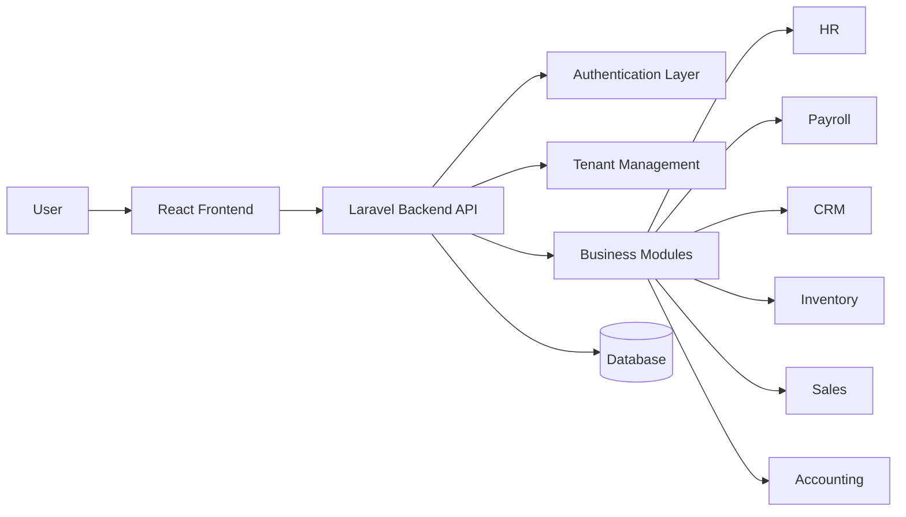

---

# 🏛️ SaaS Architecture Design

The platform separates:

## Central Layer

Responsible for:

- Platform administration
- Tenant registration
- Subscription management
- System configuration


## Tenant Layer

Responsible for:

- Organization users
- Business data
- Operational workflows

```
Central System

       │

       ├── Tenant A

       │       └── Business Data

       │

       ├── Tenant B

       │       └── Business Data

       │

       └── Tenant C

               └── Business Data
```

---

# 🛠️ Technology Stack

## Backend

- Laravel 11
- PHP 8+
- REST API
- JWT Authentication

## Frontend

- React.js
- JavaScript
- HTML5
- CSS3

## Database

- MySQL
- PostgreSQL compatible design

## Storage & Services

- Cloud Storage Support
- Background Jobs
- Caching

## Deployment

- Railway
- Render
- Docker

---

# 📂 Project Structure

```
ERP-Multi-Tenant-SaaS/

│
├── backend/
│   ├── app/
│   ├── routes/
│   ├── database/
│   ├── config/
│   └── services/
│
├── frontend/
│   ├── src/
│   ├── components/
│   ├── pages/
│   └── services/
│
├── docs/
│
├── docker/
│
└── README.md
```

---

# 📌 Current Implementation Highlights

✅ Multi-tenant foundation  
✅ Enterprise modules architecture  
✅ Secure authentication  
✅ Permission-based access control  
✅ Database-driven language system  
✅ Modular Laravel structure  
✅ React-based dashboard interface  

---
# 🗄️ Database Architecture

The ERP platform uses a structured database design optimized for scalability, security, and enterprise workflows.

## Core Database Entities

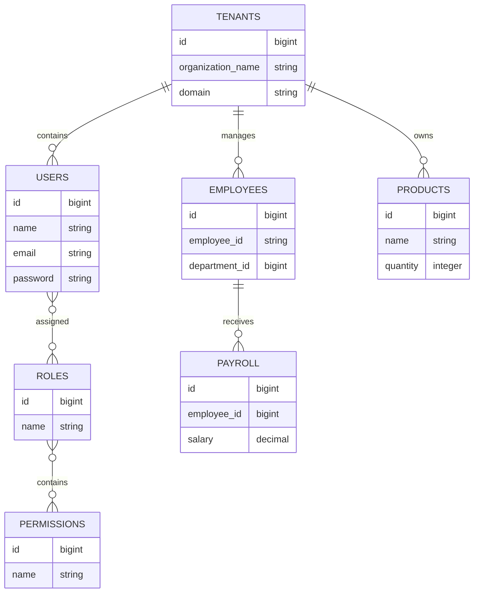

---

# 🔐 Authentication Flow

The platform uses secure authentication and authorization.

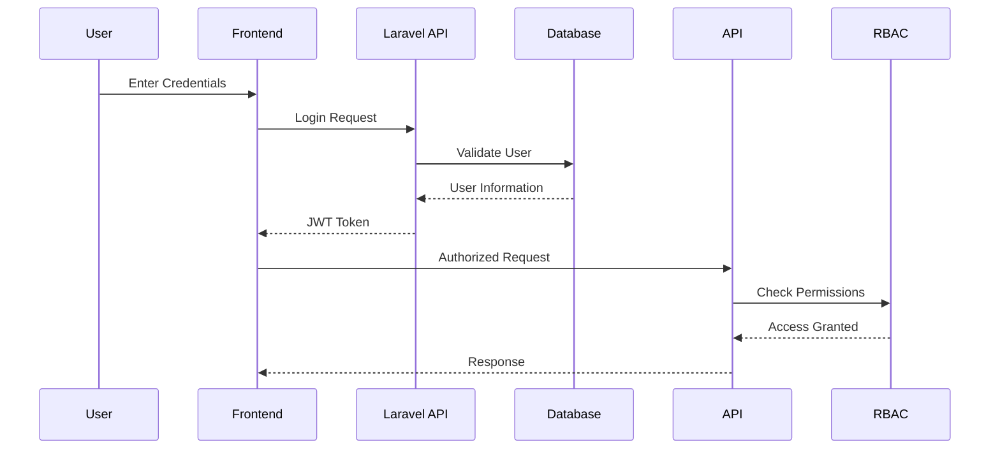

---

# 🔑 Role-Based Access Control

The permission system controls access at module level.

Example:

```
Super Admin

      ↓

Organization Admin

      ↓

Department Manager

      ↓

Employee

      ↓

Limited User
```

Each role can have customized permissions.

Examples:

| Role | Access |
|-|-|
| Super Admin | Full platform control |
| Organization Admin | Tenant management |
| HR Manager | Employee and leave management |
| Accountant | Payroll and accounting |
| Employee | Personal records |

---

# 🔌 API Architecture

The backend exposes RESTful APIs for frontend communication.

Example structure:

```
/api

 ├── auth

 │    ├── login

 │    ├── logout

 │    └── profile


 ├── tenants

 │    ├── create

 │    └── manage


 ├── employees

 │    ├── list

 │    ├── create

 │    └── update


 ├── payroll

 │    ├── generate

 │    └── reports


 └── inventory

      ├── products

      └── stock
```

---

# ⚙️ Installation Guide

## System Requirements

Recommended:

| Requirement | Specification |
|---|---|
| PHP | 8.2+ |
| Laravel | 11 |
| Node.js | 20+ |
| Database | MySQL/PostgreSQL |
| RAM | 4GB+ |

---


# 🐳 Docker Deployment

The platform supports containerized deployment.

Build containers:

```bash
docker-compose build
```

Start services:

```bash
docker-compose up
```

Services:

```
Frontend

        ↓

Laravel Application

        ↓

Database

        ↓

Storage Services
```

---

# 🚀 Production Deployment

Supported deployment environments:

- Railway
- Render
- Docker-based cloud hosting

Production checklist:

✅ Environment configuration  
✅ Database migration  
✅ Storage configuration  
✅ Cache optimization  
✅ Queue workers  
✅ Security configuration  

---

# 🧪 Testing

The project supports automated testing.

Testing areas:

- Authentication testing
- API testing
- Permission testing
- Database testing
- Module testing

Run Laravel tests:

```bash
php artisan test
```

---

# 📷 Screenshots

The ERP platform provides a modern dashboard experience with modules for employee management, attendance tracking, payroll, projects, tasks, communication, and support management.

## 🔐 Authentication

### Login Page


---

# 👨‍💼 Employee Dashboard


---

# ⏱️ Attendance Management

### Attendance Table


### Attendance Details (Admin View)

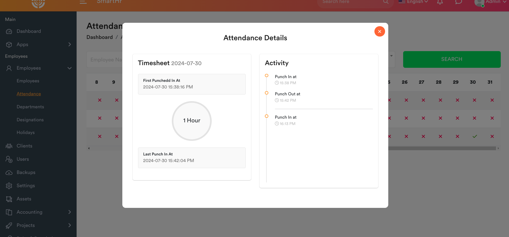

---

# 💰 Payroll Management

### Payslip Management

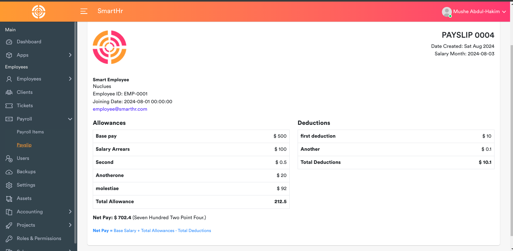


### Payslip Items

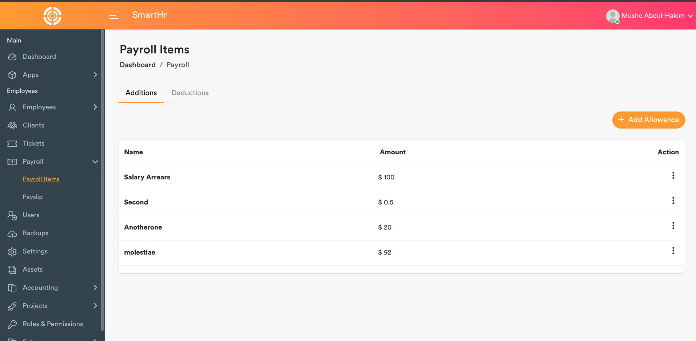

---

# 📋 Task & Project Management

### Task Board


### Add Task Board

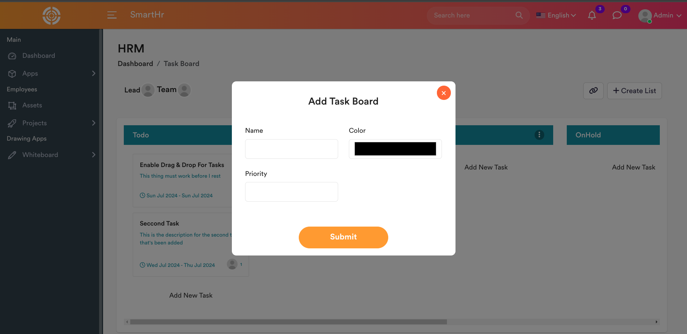


### Projects Grid

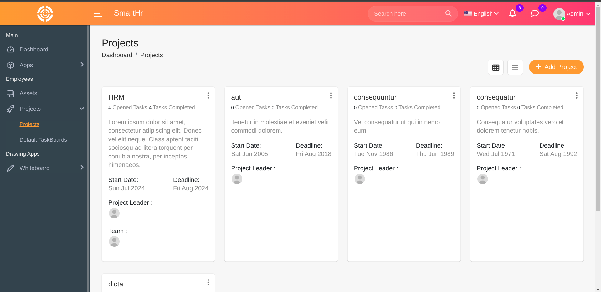


### Project Details


---

# 💬 Communication System

### Chat Application

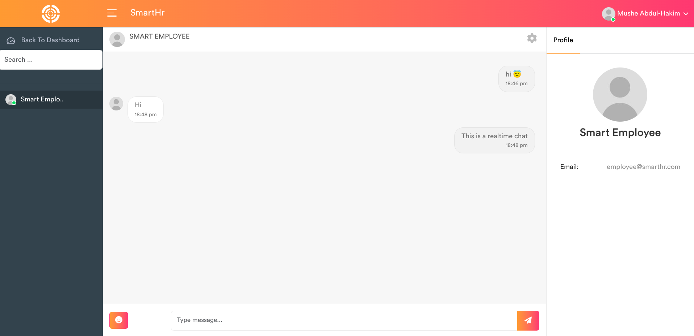


### Ticket Chat

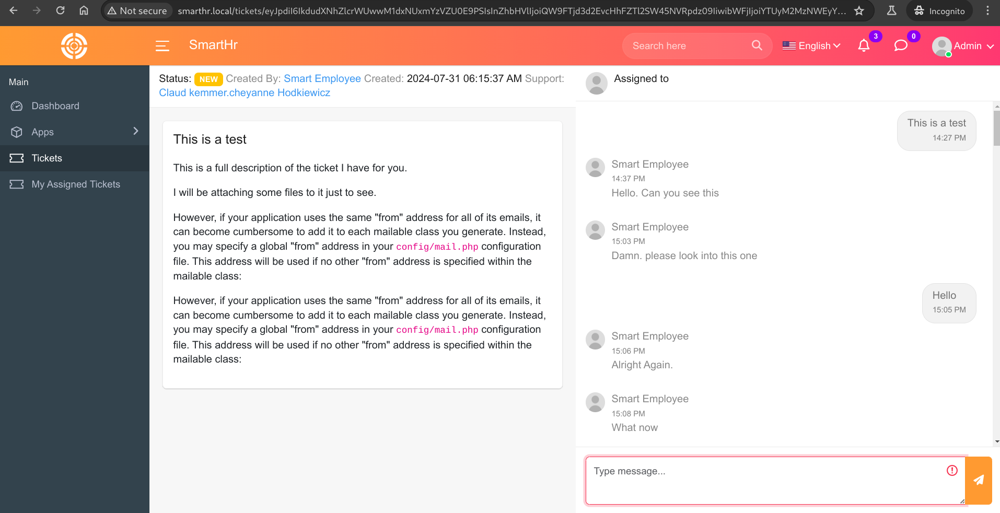

---

# 🎨 Design & Collaboration Tools

### Excalidraw Integration


### tldraw Integration

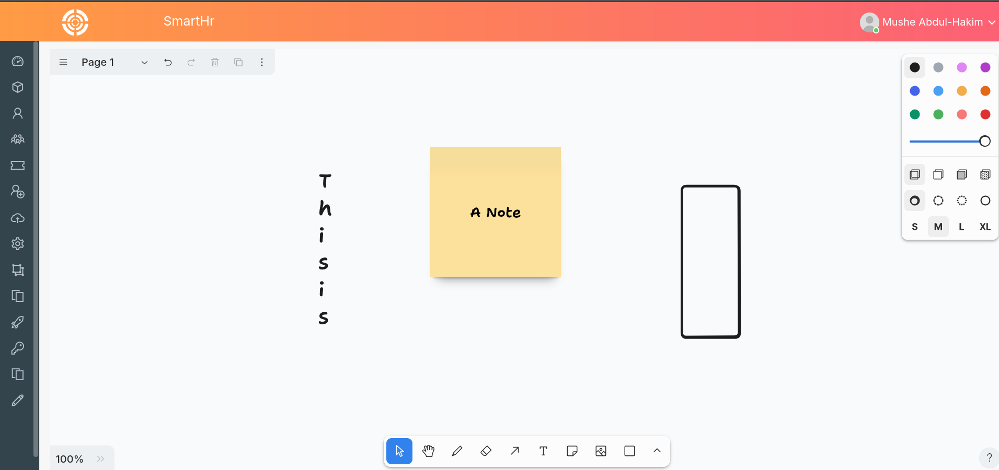

# 🔒 Security Features

The system includes:

✅ Authentication protection  
✅ Role-based permissions  
✅ Tenant data isolation  
✅ Secure API access  
✅ Validation layer  
✅ Protected routes  
✅ Environment-based configuration  

---

# 🚀 Future Improvements

Planned improvements:

## Mobile Application

- Android/iOS ERP mobile client
- Employee self-service application

## Advanced Analytics

- Business intelligence dashboards
- Predictive analytics
- AI-powered recommendations

## SaaS Expansion

- Subscription billing
- Automated tenant onboarding
- Usage monitoring

## Enterprise Scaling

- Microservice architecture
- Kubernetes deployment
- Cloud auto-scaling

---

# 🤝 Contributing

Contributions are welcome.

Steps:

1. Fork the repository

2. Create a feature branch:

```bash
git checkout -b feature/new-feature
```

3. Commit changes:

```bash
git commit -m "Add new feature"
```

4. Push:

```bash
git push origin feature/new-feature
```

5. Open a Pull Request

---

# 📜 License

This project is licensed under the MIT License.

---

# 📬 Connect With Me

<p align="left">

<a href="mailto:kidusyared005@gmail.com">

</a>

<a href="https://www.linkedin.com/in/kidus-yared-3ab306412">

</a>

</p>

---

⭐ If you find this project useful, consider giving it a star.
