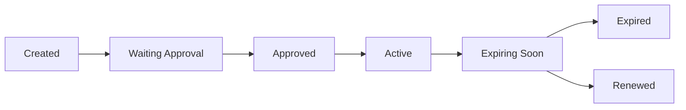
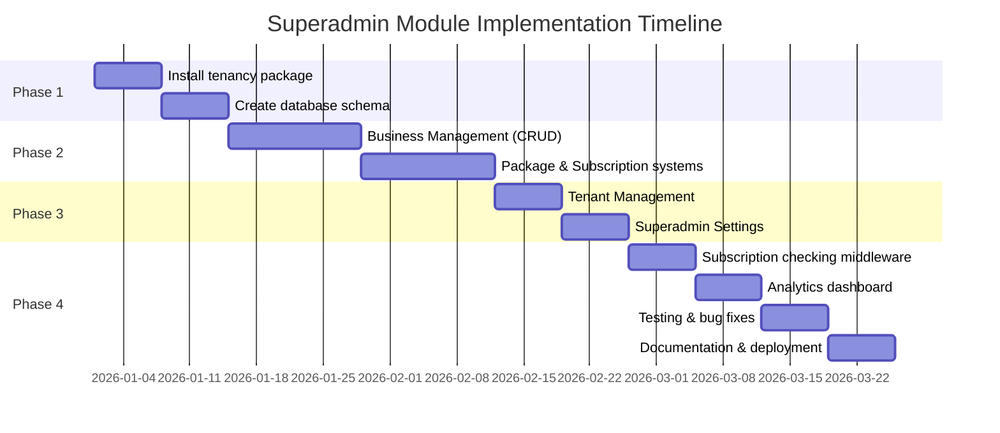

# 📊 Deep Analysis & Implementation Plan
## Superadmin Module for TewosHR ERP System


> 📝 **Analysis Scope**: This document provides a comprehensive comparison and implementation strategy based on three systems:
> - **TewosHR** (`D:\Tewos Technology\tewoshr`)
> - **Old ERP System** (`D:\Tewos Technology\erp.ettech.et`)
> - **Odoo** (Open-source reference)

---

## 📑 Table of Contents

- [I. Architectural Analysis](#i-architectural-analysis)
- [II. Key Implementation Concepts](#ii-key-implementation-concepts)
- [III. Detailed Implementation Plan](#iii-detailed-implementation-plan)
- [IV. Key Differences Comparison](#iv-key-differences-old-erp-vs-odoo-vs-recommended)
- [V. Implementation Roadmap](#v-implementation-roadmap)
- [VI. Critical Implementation Notes](#vi-critical-implementation-notes)
- [VII. Testing Strategy](#vii-testing-strategy)

---

## I. ARCHITECTURAL ANALYSIS

### 🎯 A. Current State Assessment

#### 1️⃣ **TewosHR** (Target System)
`Location: D:\Tewos Technology\tewoshr`

| Component | Details |
|-----------|---------|
| **Framework** | Laravel 11 with modular architecture (`nwidart/laravel-modules`) |
| **Current Modules** | 12 modules: Accounting, Contacts, CRM, Logistics, ProductCatalogue, Products, Project, Purchase, Roles, Sales, StockAdjustment, Whiteboard |
| **Architecture** | Single-tenant with `business_id` scoping |
| **Tech Stack** | PHP 8.2, Laravel 11, Livewire 3.5, MySQL |
| **Key Features** | Modern UI (Alpine.js, Tailwind-style), Spatie permissions, Media library |

#### 2️⃣ **Old ERP System** (Reference)
`Location: D:\Tewos Technology\erp.ettech.et`

**Superadmin Module Components:**

| Component | Description |
|-----------|-------------|
| **Business Management** | Multi-business management with activation control |
| **Tenant Management** | Basic tenant creation/deletion with database prefixing |
| **Package System** | Complex package management with 59+ permission flags |
| **Subscription System** | Time-based subscriptions with module activation |
| **Key Controllers** | `BusinessController` (2,227 lines), `PackagesController` (1,851 lines), `TenantManagementController`, `SuperadminSettingsController` |

#### 3️⃣ **Odoo Architecture** (Best Practices Reference)

| Feature | Implementation |
|---------|---------------|
| **Multi-Tenancy** | Database-per-tenant approach with centralized authentication |
| **Module System** | Highly modular with dependency management |
| **Subscription Model** | SaaS-ready with automated billing |
| **Company Hierarchy** | Multi-company support within tenants |

---

## II. KEY IMPLEMENTATION CONCEPTS

### 🏗️ A. Multi-Tenancy Strategy

**🎯 Recommended Approach for TewosHR: Hybrid Multi-Tenancy**

    ┌─────────────────────────────────────────────┐
    │         Central Database (Master)            │
    │  ┌─────────────────────────────────────┐    │
    │  │  - Tenants Table                     │    │
    │  │  - Packages Table                    │    │
    │  │  - Subscriptions Table               │    │
    │  │  - Superadmin Users                  │    │
    │  └─────────────────────────────────────┘    │
    └─────────────────────────────────────────────┘
                        ↓
        ┌──────────────┴──────────────┐
        │                              │
    ┌────▼─────┐              ┌────────▼────┐
    │ Tenant 1 │              │  Tenant 2   │
    │ Database │              │  Database   │
    │ (Full    │              │  (Full      │
    │  Schema) │              │   Schema)   │
    └──────────┘              └─────────────┘

**✅ Why This Approach?**

| Benefit | Description |
|---------|-------------|
| 🔒 **Data Isolation** | Complete separation per business (security & compliance) |
| 📈 **Scalability** | Easy to scale individual tenants |
| 🎨 **Customization** | Per-tenant schema modifications possible |
| 🌟 **Odoo-Inspired** | Similar to Odoo's db-filter approach |

---

## III. DETAILED IMPLEMENTATION PLAN

### 📦 Phase 1: Foundation Setup (Weeks 1-3)

#### 1.1 Install Multi-Tenancy Package

```bash
composer require stancl/tenancy
```

#### 1.2 Database Structure

**Central Database Tables:**

```sql
-- businesses (already exists, extend it)
    ALTER TABLE businesses ADD COLUMN tenant_id VARCHAR(255) UNIQUE;
    ALTER TABLE businesses ADD COLUMN subdomain VARCHAR(255) UNIQUE;
    ALTER TABLE businesses ADD COLUMN is_active TINYINT DEFAULT 1;
    ALTER TABLE businesses ADD COLUMN package_id INT UNSIGNED;
    ALTER TABLE businesses ADD COLUMN created_by INT UNSIGNED;

    -- packages
    CREATE TABLE packages (
        id BIGINT UNSIGNED AUTO_INCREMENT PRIMARY KEY,
        name VARCHAR(255) NOT NULL,
        description TEXT,
        price DECIMAL(22,4) DEFAULT 0,
        currency_id INT UNSIGNED,
        interval ENUM('days', 'months', 'years') DEFAULT 'months',
        interval_count INT DEFAULT 1,
        trial_days INT DEFAULT 0,

        -- Limits
        location_count INT DEFAULT 0,
        user_count INT DEFAULT 0,
        product_count INT DEFAULT 0,
        invoice_count INT DEFAULT 0,

        -- Module Permissions (JSON column for flexibility)
        custom_permissions JSON,

        -- Settings
        is_active TINYINT DEFAULT 1,
        is_private TINYINT DEFAULT 0,
        sort_order INT DEFAULT 0,

        created_at TIMESTAMP DEFAULT CURRENT_TIMESTAMP,
        updated_at TIMESTAMP DEFAULT CURRENT_TIMESTAMP ON UPDATE CURRENT_TIMESTAMP,
        deleted_at TIMESTAMP NULL
    );

    -- subscriptions
    CREATE TABLE subscriptions (
        id BIGINT UNSIGNED AUTO_INCREMENT PRIMARY KEY,
        business_id INT UNSIGNED NOT NULL,
        package_id INT UNSIGNED,

        start_date DATE,
        end_date DATE,

        -- Package snapshot at subscription time
        package_details JSON,

        -- Module activation tracking
        module_activation_details JSON,

        -- Pricing
        paid_via VARCHAR(255),
        payment_transaction_id VARCHAR(255),

        status ENUM('approved', 'waiting', 'declined') DEFAULT 'waiting',

        created_id INT UNSIGNED,
        created_at TIMESTAMP DEFAULT CURRENT_TIMESTAMP,
        updated_at TIMESTAMP DEFAULT CURRENT_TIMESTAMP ON UPDATE CURRENT_TIMESTAMP,
        deleted_at TIMESTAMP NULL,

        FOREIGN KEY (business_id) REFERENCES businesses(id) ON DELETE CASCADE,
        FOREIGN KEY (package_id) REFERENCES packages(id) ON DELETE SET NULL
    );

    -- tenants (for multi-tenancy)
    CREATE TABLE tenants (
        id VARCHAR(255) PRIMARY KEY,
        business_id INT UNSIGNED UNIQUE,
        data JSON,
        created_at TIMESTAMP DEFAULT CURRENT_TIMESTAMP,
        updated_at TIMESTAMP DEFAULT CURRENT_TIMESTAMP ON UPDATE CURRENT_TIMESTAMP
    );

    -- domains (for subdomain routing)
    CREATE TABLE domains (
        id BIGINT UNSIGNED AUTO_INCREMENT PRIMARY KEY,
        domain VARCHAR(255) UNIQUE NOT NULL,
        tenant_id VARCHAR(255) NOT NULL,
        created_at TIMESTAMP DEFAULT CURRENT_TIMESTAMP,
        updated_at TIMESTAMP DEFAULT CURRENT_TIMESTAMP ON UPDATE CURRENT_TIMESTAMP,

        FOREIGN KEY (tenant_id) REFERENCES tenants(id) ON DELETE CASCADE
    );
```

#### 1.3 Module Structure

```plaintext

    Modules/Superadmin/
    ├── app/
    │   ├── Http/
    │   │   ├── Controllers/
    │   │   │   ├── BusinessController.php
    │   │   │   ├── TenantManagementController.php
    │   │   │   ├── PackagesController.php
    │   │   │   ├── SubscriptionsController.php
    │   │   │   └── SuperadminSettingsController.php
    │   │   ├── Middleware/
    │   │   │   ├── SuperadminMiddleware.php
    │   │   │   └── CheckSubscriptionMiddleware.php
    │   │   └── Requests/
    │   │       ├── CreateBusinessRequest.php
    │   │       └── CreatePackageRequest.php
    │   ├── Models/
    │   │   ├── Business.php (extended)
    │   │   ├── Package.php
    │   │   ├── Subscription.php
    │   │   └── Tenant.php
    │   ├── Services/
    │   │   ├── TenantService.php
    │   │   ├── SubscriptionService.php
    │   │   └── PackageService.php
    │   └── Notifications/
    │       ├── SubscriptionExpiring.php
    │       └── NewBusinessWelcome.php
    ├── database/
    │   ├── migrations/
    │   └── seeders/
    ├── resources/
    │   └── views/
    │       ├── businesses/
    │       ├── packages/
    │       ├── subscriptions/
    │       └── tenants/
    └── routes/
        ├── web.php
        └── api.php
```

---

### 🚀 Phase 2: Core Superadmin Features (Weeks 4-6)

#### 2.1 Business Management

**Key Features to Implement:**

```php
// app/Http/Controllers/Superadmin/BusinessController.php

    class BusinessController extends Controller
    {
        public function index()
        {
            // List all businesses with:
            // - Active subscription status
            // - Package details
            // - User count, location count
            // - Last activity
            // - Revenue metrics
        }

        public function create()
        {
            // Create new business with:
            // - Owner details (auto-create user)
            // - Business information
            // - Initial location
            // - Package selection
            // - Default settings initialization
        }

        public function manage($id)
        {
            // Detailed business management:
            // - Custom package permissions override
            // - Module activation/deactivation
            // - Subscription history
            // - Usage analytics
            // - Custom pricing
        }

        public function toggleActive($id)
        {
            // Activate/Deactivate business access
        }
    }
```

**🔄 Critical Business Creation Flow** (from old ERP):

1. ✅ Create owner user
2. ✅ Create business record
3. ✅ Create tenant database
4. ✅ Migrate tenant schema
5. ✅ Seed default data (accounts, categories, taxes)
6. ✅ Create business location
7. ✅ Assign default permissions
8. ✅ Send welcome notification

---

#### 2.2 Package Management

**📋 Package Permission Categories** (based on old ERP analysis):

```php
// Package permissions structure
    [
        'modules' => [
            'manufacturing' => ['enabled' => true, 'price' => 50, 'interval' => 'month'],
            'accounting' => ['enabled' => true, 'price' => 100, 'interval' => 'month'],
            'hr' => ['enabled' => true, 'price' => 75, 'interval' => 'month'],
            'crm' => ['enabled' => true, 'price' => 60, 'interval' => 'month'],
            'petro' => ['enabled' => false, 'price' => 200, 'interval' => 'month'],
            'fleet' => ['enabled' => false, 'price' => 80, 'interval' => 'month'],
            // ... more modules
        ],

        'features' => [
            'multi_location' => true,
            'backup_module' => true,
            'sms_notifications' => true,
            'custom_reports' => false,
            // ... more features
        ],

        'limits' => [
            'users' => 10,
            'locations' => 3,
            'products' => 1000,
            'monthly_invoices' => 500,
        ],

        'integrations' => [
            'payment_gateways' => ['stripe', 'paypal'],
            'accounting_sync' => false,
        ]
    ]
```

**Package Controller Structure:**

```php
class PackagesController extends Controller
    {
        public function index()
        {
            // List packages with:
            // - Active subscribers count
            // - Monthly recurring revenue (MRR)
            // - Package visibility (public/private)
        }

        public function create()
        {
            // Package builder with:
            // - Module selection (checkboxes)
            // - Pricing per module
            // - Limit settings
            // - Trial period configuration
        }

        public function getModuleSubscriptions()
        {
            // DataTables: Show module-level subscriptions
            // Filter by status, date range, business
        }
    }
```

---

#### 2.3 Subscription System

**📊 Subscription Lifecycle:**



**Key Features:**

```php
class SubscriptionService
    {
        public function createSubscription($businessId, $packageId, $paymentDetails)
        {
            // 1. Get package details
            // 2. Calculate start/end dates
            // 3. Create subscription record
            // 4. Store payment info
            // 5. Update business permissions
            // 6. Send confirmation notification
        }

        public function checkModuleAccess($businessId, $moduleName)
        {
            // Real-time module access checking
            // Used in middleware
        }

        public function calculateModuleExpiry($businessId, $moduleName)
        {
            // Calculate individual module expiry
            // Based on activation data
        }

        public function handleExpiredSubscription($subscription)
        {
            // 1. Grace period (e.g., 7 days)
            // 2. Restrict access (read-only mode)
            // 3. Send reminder notifications
            // 4. Archive after X days
        }
    }
```

**🔒 Subscription Middleware** (Critical for security):

```php
// app/Http/Middleware/CheckSubscriptionMiddleware.php

    class CheckSubscriptionMiddleware
    {
        public function handle($request, Closure $next, $module = null)
        {
            $business = auth()->user()->business;
            $subscription = Subscription::active_subscription($business->id);

            if (!$subscription) {
                return redirect()->route('subscription.expired');
            }

            // Check module-specific access
            if ($module && !$this->hasModuleAccess($subscription, $module)) {
                abort(403, 'Module access denied');
            }

            // Check limits (users, products, etc.)
            if (!$this->withinLimits($subscription, $business)) {
                return redirect()->route('subscription.limit-exceeded');
            }

            return $next($request);
        }
    }
```

---

#### 2.4 Tenant Management

**Tenant Operations:**

```php
class TenantService
    {
        public function createTenant($businessData)
        {
            // 1. Generate tenant ID (subdomain)
            // 2. Create tenant record
            // 3. Create tenant database (with prefix)
            // 4. Run migrations on tenant DB
            // 5. Seed default data
            // 6. Create domain record
            // 7. Link to business

            // Example: business123.tewostechsolutions.com → business123_erp_db
        }

        public function deleteTenant($tenantId)
        {
            // 1. Backup tenant data
            // 2. Remove domain records
            // 3. Delete tenant database
            // 4. Remove tenant record
            // 5. Archive business record
        }

        public function switchTenant($tenantId)
        {
            // For superadmin to access any tenant
            // Impersonate functionality
        }
    }
```

**Environment Configuration:**

```env
# .env additions
TENANT_DATABASE_PREFIX=tenant_
CENTRAL_DOMAIN=tewostechsolutions.com
SUPERADMIN_EMAIL=admin@tewostechsolutions.com
```

---

### ⚙️ Phase 3: Settings & Permissions (Weeks 7-8)

#### 3.1 Superadmin Settings

**Settings Categories:**

1. **Application Settings**
   - Site name, logo, favicon
   - Default currency, timezone, language
   - Date/time formats

2. **Business Registration** (Manual Only)
   - Default package for new businesses
   - Email verification required
   - Manual approval workflow

3. **Email Settings** (Email Only - No SMS)
   - SMTP configuration (host, port, username, password, encryption)
   - Email from address and name
   - Email notification templates

4. **Payment Management** (Manual Bank Receipts)
   - Manual payment approval workflow
   - Bank receipt upload functionality
   - Payment proof storage path
   - Supported payment methods (Bank Transfer, Check, Cash)

5. **Default Resources**
   - Default chart of accounts
   - Default product categories
   - Default tax rates
   - Default email notification templates

#### 3.2 Permission System

**Permission Levels:**

```plaintext
1. Superadmin Permissions (central)
   - manage_businesses
   - manage_packages
   - manage_subscriptions
   - manage_tenants
   - view_analytics
   - configure_system

2. Package Permissions (per subscription)
   - Module-level (enable/disable modules)
   - Feature-level (specific features within modules)
   - Limit-level (users, products, invoices)

3. User Permissions (per tenant)
   - Standard Laravel/Spatie permissions
   - Role-based access control (RBAC)
```

---

### 📈 Phase 4: Advanced Features (Weeks 9-12)

#### 4.1 Analytics Dashboard

**📊 Key Metrics:**

- 📈 Total businesses (active/inactive)
- 💰 Total revenue (MRR, ARR)
- 📦 Subscription distribution by package
- 📊 Module usage statistics
- 📉 Churn rate
- 💵 Average revenue per user (ARPU)

#### 4.2 Manual Payment & Billing

**Manual Bank Receipt Processing:**

```php
// Manual payment submission by business owner
// Bank receipt upload (PDF, JPG, PNG)
// Payment verification by superadmin
// Manual payment approval/rejection
// Invoice generation after approval
// Email invoice to business owner
// Payment history tracking
```

**Features:**
- Upload bank receipt/transfer proof
- Enter payment reference number
- Select payment method (Bank Transfer, Check, Cash)
- Payment approval queue for superadmin
- Automatic subscription activation upon approval
- Email notification to business on approval/rejection

#### 4.3 Module Marketplace (Future)

```php
// Install/uninstall modules per tenant
// Module versioning
// Automatic updates
// Compatibility checking
```

---

## IV. KEY DIFFERENCES: OLD ERP vs. ODOO vs. RECOMMENDED

| Feature | Old ERP (erp.ettech.et) | Odoo | ✅ Recommended for TewosHR |
|---------|-------------------------|------|----------------------------|
| **Multi-Tenancy** | Single DB with `business_id` | Database per tenant | **Hybrid: DB per tenant** |
| **Subscription Model** | Complex JSON in subscriptions table | Modular with dependencies | **Simplified JSON + limits** |
| **Module Management** | 59+ boolean flags | Dependency-based modules | **Laravel Modules package** |
| **Package Permissions** | Monolithic controller (2,227 lines) | Distributed across modules | **Service-based architecture** |
| **Tenant Isolation** | Soft (`business_id` scoping) | Hard (separate databases) | **Hard (separate databases)** |
| **UI/UX** | Legacy Blade templates | XML/JS framework | **Modern Livewire + Alpine** |

---

## V. IMPLEMENTATION ROADMAP



| Week | Task | Status |
|------|------|--------|
| 1-2  | Install tenancy package, create database schema | 🟡 Pending |
| 3-4  | Implement Business Management (CRUD) | 🟡 Pending |
| 5-6  | Implement Package & Subscription systems | 🟡 Pending |
| 7    | Implement Tenant Management | 🟡 Pending |
| 8    | Implement Superadmin Settings | 🟡 Pending |
| 9    | Build middleware for subscription checking | 🟡 Pending |
| 10   | Implement analytics dashboard | 🟡 Pending |
| 11   | Testing & bug fixes | 🟡 Pending |
| 12   | Documentation & deployment | 🟡 Pending |

---

## VI. CRITICAL IMPLEMENTATION NOTES

### 🔐 Security Considerations

| # | Consideration | Description |
|---|---------------|-------------|
| 1 | **Tenant Isolation** | Ensure no cross-tenant data leakage |
| 2 | **Superadmin Access** | Separate authentication for superadmin |
| 3 | **API Rate Limiting** | Per-tenant rate limits |
| 4 | **Data Encryption** | Encrypt sensitive subscription data |

### ⚡ Performance Optimization

| # | Strategy | Implementation |
|---|----------|----------------|
| 1 | **Database Connection Pooling** | For multi-tenant DB connections |
| 2 | **Caching** | Cache subscription status per tenant |
| 3 | **Queue Jobs** | Background jobs for tenant creation, migrations |
| 4 | **CDN** | Static assets via CDN |

### 📊 Scalability Planning

| Threshold | Action Required |
|-----------|-----------------|
| Tenant count > 1000 | **Database Sharding** |
| High traffic | **Load Balancing** (Multiple app servers) |
| Complex operations | **Microservices** (Extract billing, tenant management) |

---

## VII. TESTING STRATEGY

### ✅ Test Coverage

| Test Type | Scope | Priority |
|-----------|-------|----------|
| **Unit Tests** | Service classes, models | 🔴 High |
| **Feature Tests** | Controllers, middleware | 🔴 High |
| **Integration Tests** | Multi-tenancy flow, subscription lifecycle | 🟠 Medium |
| **Manual Testing** | Complete business creation flow, module activation | 🟢 Low |

---

## 🎯 Conclusion

This analysis provides a **production-ready roadmap** combining the best practices from:

- ✅ Your old ERP system (battle-tested features)
- ✅ Odoo's architecture (industry-standard patterns)
- ✅ Modern Laravel multi-tenancy patterns (latest technology)

> 💡 **Key Takeaway**: Start with a solid foundation (Phase 1) before building complex features. Focus on tenant isolation, subscription management, and scalable architecture from day one.

---

**📚 Additional Resources:**

- [Laravel Multi-Tenancy Package](https://tenancyforlaravel.com/)
- [Odoo Multi-Tenancy Documentation](https://www.odoo.com/documentation/)
- [Laravel Modules Package](https://nwidart.com/laravel-modules/)
- [Spatie Laravel Permission](https://spatie.be/docs/laravel-permission/)

---

**👥 Team Responsibilities:**

| Team Member | Module Responsibility |
|-------------|----------------------|
| Backend Lead | Tenant Management, Subscription Logic |
| Full-Stack Dev | Business Management, Package CRUD |
| Frontend Dev | Superadmin Dashboard, Analytics |
| DevOps | Database Setup, Multi-Tenancy Infrastructure |
| QA | Testing Strategy Implementation |

---

*Last Updated: January 1, 2026*  
*Version: 1.0*  
*Status: Planning Phase* 🟡

---

## 📋 COMPREHENSIVE IMPLEMENTATION PROCEDURE (Statements Only)

### **PHASE 1: Foundation Setup & Database (Weeks 1-3)**

#### **1.1 Environment & Package Setup**
1. Install `stancl/tenancy` package via Composer
2. Publish tenancy configuration files
3. Configure `.env` file with `TENANT_DATABASE_PREFIX` and `CENTRAL_DOMAIN`
4. Create `config/tenancy.php` configuration file
5. Update `config/database.php` for multi-database support

#### **1.2 Central Database Setup**
6. Create central database: `tewoshr_central` in cPanel
7. Update `.env` to point to central database
8. Create migration for extending `businesses` table (add `tenant_id`, `subdomain`, `is_active`, `package_id`, `created_by`)
9. Create migration for `packages` table
10. Create migration for `subscriptions` table
11. Create migration for `tenants` table
12. Create migration for `domains` table
13. Create migration for `manual_payments` table (for bank receipt tracking)
14. Create migration for `payment_receipts` table (for uploaded files)
15. Run all migrations on central database
16. Seed initial superadmin user
17. Seed default currencies

#### **1.3 Module Structure Creation**
18. Generate Superadmin module using `php artisan module:make Superadmin`
19. Create directory structure: Controllers, Models, Services, Middleware, Notifications, Views
20. Create `BusinessController` file
21. Create `TenantManagementController` file
22. Create `PackagesController` file
23. Create `SubscriptionsController` file
24. Create `SuperadminSettingsController` file
25. Create `ManualPaymentController` file
26. Create `AnalyticsDashboardController` file

#### **1.4 Model Creation**
27. Create `Tenant` model with relationships
28. Create `Package` model with JSON casting for permissions
29. Create `Subscription` model with package relationship and status scopes
30. Extend `Business` model with tenant relationship
31. Create `ManualPayment` model
32. Create `PaymentReceipt` model
33. Define model relationships (Business hasOne Tenant, Business hasMany Subscriptions, etc.)

#### **1.5 Service Layer**
34. Create `TenantService` class with methods: `createTenantRecord`, `generateInstructions`, `validateConnection`, `runMigrations`, `seedDefaults`
35. Create `SubscriptionService` class with methods: `createSubscription`, `checkModuleAccess`, `calculateExpiry`, `handleExpired`
36. Create `PackageService` class with methods: `calculatePrice`, `getModulePermissions`
37. Create `ManualPaymentService` class with methods: `uploadReceipt`, `approvePayment`, `rejectPayment`, `generateInvoice`

#### **1.6 Middleware Creation**
38. Create `SuperadminMiddleware` for superadmin-only routes
39. Create `IdentifyTenant` middleware for subdomain detection
40. Create `CheckSubscription` middleware for subscription validation
41. Create `CheckModuleAccess` middleware for module-level permissions
42. Register all middleware in `app/Http/Kernel.php`
43. Apply middleware to route groups

---

### **PHASE 2: Business & Package Management (Weeks 4-6)**

#### **2.1 Business Management - Backend**
44. Implement `BusinessController@index` with DataTables listing
45. Implement `BusinessController@create` with form validation
46. Implement `BusinessController@store` with business creation logic
47. Implement `BusinessController@show` with business details
48. Implement `BusinessController@manage` with custom permissions
49. Implement `BusinessController@toggleActive` for activation/deactivation
50. Create `CreateBusinessRequest` validation class
51. Create business creation workflow: validate input → create owner user → create business record → create tenant record
52. Generate tenant setup instructions (database name, subdomain)
53. Store tenant metadata in central database

#### **2.2 Business Management - Frontend**
54. Create business listing view (`resources/views/superadmin/businesses/index.blade.php`)
55. Create business creation form view
56. Create business details view with tabs (Info, Subscription, Users, Analytics)
57. Create business management view with module toggles
58. Add DataTables for business listing with filters (active/inactive, package, date range)
59. Add search functionality
60. Add export functionality (Excel, PDF)

#### **2.3 Tenant Database Setup Wizard**
61. Create tenant setup wizard view
62. Step 1: Display generated database name and creation instructions
63. Step 2: Display subdomain creation instructions
64. Step 3: Database connection form (enter database name, user, password)
65. Step 4: Test database connection
66. Step 5: Run migrations button
67. Step 6: Seed defaults button (accounts, categories, taxes)
68. Step 7: Create business location
69. Step 8: Complete setup and send welcome email
70. Implement progress tracker UI

#### **2.4 Package Management - Backend**
71. Implement `PackagesController@index` with package listing
72. Implement `PackagesController@create` with package form
73. Implement `PackagesController@store` with validation
74. Implement `PackagesController@edit` and `update`
75. Implement `PackagesController@destroy` with safety checks
76. Create `CreatePackageRequest` validation class
77. Define package permission structure (modules, features, limits)
78. Implement package duplication feature
79. Implement package activation/deactivation

#### **2.5 Package Management - Frontend**
80. Create package listing view
81. Create package form view with module checkboxes
82. Create pricing configuration form (per module pricing)
83. Create limits configuration form (users, products, invoices, locations)
84. Create trial period configuration
85. Add package preview functionality
86. Add sort order management
87. Add visibility toggle (public/private)

---

### **PHASE 3: Subscription & Payment System (Weeks 6-7)**

#### **3.1 Subscription Management**
88. Implement `SubscriptionsController@index` with subscription listing
89. Implement `SubscriptionsController@create` (manual subscription creation)
90. Implement `SubscriptionsController@store` with date calculations
91. Implement `SubscriptionsController@approve` for approval workflow
92. Implement `SubscriptionsController@decline` with reason
93. Implement `SubscriptionsController@renew` for renewals
94. Create subscription listing view with filters (status, package, business, date range)
95. Create subscription details view
96. Create subscription approval queue view
97. Implement subscription status tracking (waiting, approved, active, expired)
98. Implement grace period logic (7 days)
99. Create subscription expiry checking command
100. Schedule command to run daily

#### **3.2 Manual Payment System**
101. Create `manual_payments` migration with fields: business_id, subscription_id, amount, currency, payment_method, reference_number, receipt_path, status, notes
102. Implement `ManualPaymentController@create` (business owner submits payment)
103. Implement `ManualPaymentController@store` with file upload
104. Implement `ManualPaymentController@index` (superadmin payment queue)
105. Implement `ManualPaymentController@approve` (approve payment → activate subscription)
106. Implement `ManualPaymentController@reject` with rejection reason
107. Create payment submission form for business owner
108. Add file upload functionality (bank receipts: PDF, JPG, PNG max 5MB)
109. Create payment approval queue view for superadmin
110. Create payment history view
111. Implement payment proof viewer (view uploaded receipt)
112. Send email notification to business on payment status change

#### **3.3 Invoice Generation**
113. Create `InvoiceService` class
114. Implement `generateInvoice()` method with PDF generation
115. Create invoice template (Blade view)
116. Add invoice number generation logic
117. Store invoices in `storage/app/invoices/{business_id}/`
118. Implement invoice download functionality
119. Send invoice email attachment after payment approval
120. Create invoice history view

---

### **PHASE 4: Settings & Permissions (Week 8)**

#### **4.1 Superadmin Settings**
121. Implement `SuperadminSettingsController@index`
122. Implement `SuperadminSettingsController@update`
123. Create settings view with tabs: Application, Business Registration, Email, Payment, Defaults
124. **Application Settings Tab**: Site name input, logo upload, favicon upload, default currency select, timezone select, language select, date format select
125. **Business Registration Tab**: Default package select, email verification toggle, manual approval workflow toggle
126. **Email Settings Tab**: SMTP host input, SMTP port input, SMTP username input, SMTP password input, encryption select (TLS/SSL), from address input, from name input
127. Create email template editor for notifications (welcome email, subscription expiry, payment confirmation)
128. **Payment Settings Tab**: Payment methods checkboxes (Bank Transfer, Check, Cash), receipt storage path, bank details display
129. **Default Resources Tab**: Default accounts textarea, default categories textarea, default taxes textarea
130. Store settings in `system_settings` table or JSON config file
131. Validate settings before saving

#### **4.2 Permission System**
132. Create superadmin permissions migration
133. Seed superadmin permissions: `manage_businesses`, `manage_packages`, `manage_subscriptions`, `manage_tenants`, `view_analytics`, `configure_system`
134. Create superadmin role
135. Assign superadmin role to initial user
136. Implement package permission checking in `CheckSubscriptionMiddleware`
137. Implement module-level access checking
138. Implement feature-level access checking
139. Implement limit checking (users count, products count, invoices count)
140. Create permission helpers: `canAccessModule()`, `withinLimit()`
141. Apply permission checks to all tenant routes

---

### **PHASE 5: Tenant Management & Switching (Week 9)**

#### **5.1 Tenant Identification**
142. Implement tenant identification in `IdentifyTenant` middleware
143. Extract subdomain from request URL
144. Query `tenants` table by subdomain
145. Query `domains` table as fallback
146. Set tenant context in application container
147. Store tenant_id in session
148. Handle tenant not found scenario (404 or redirect)

#### **5.2 Database Connection Switching**
149. Implement dynamic database connection in `IdentifyTenant` middleware
150. Get tenant database credentials from tenant record
151. Configure new database connection dynamically
152. Purge old connection
153. Reconnect with tenant database
154. Set as default connection for request lifecycle
155. Test connection switching with sample queries

#### **5.3 Tenant Impersonation**
156. Implement `TenantManagementController@impersonate`
157. Create impersonation UI (button in business listing)
158. Store original admin user in session
159. Switch to tenant database
160. Redirect to tenant dashboard
161. Add "Exit Impersonation" button in tenant UI
162. Implement `exitImpersonation()` method
163. Restore original admin session
164. Redirect back to superadmin dashboard

#### **5.4 Tenant Backup & Deletion**
165. Implement `TenantManagementController@backup`
166. Create database backup using `mysqldump` command
167. Store backup in `storage/app/backups/{tenant_id}/`
168. Add download backup functionality
169. Implement `TenantManagementController@destroy`
170. Display deletion confirmation modal with backup reminder
171. Create tenant deletion instructions (manual database deletion in cPanel)
172. Archive tenant record (soft delete)
173. Archive business record
174. Send deletion notification email

---

### **PHASE 6: Analytics Dashboard (Week 10)**

#### **6.1 Dashboard Metrics**
175. Implement `AnalyticsDashboardController@index`
176. Calculate total businesses count (active/inactive)
177. Calculate total revenue (sum all approved subscription payments)
178. Calculate MRR (Monthly Recurring Revenue)
179. Calculate ARR (Annual Recurring Revenue)
180. Calculate churn rate (cancelled subscriptions / total subscriptions)
181. Calculate ARPU (Average Revenue Per User)
182. Get subscription distribution by package
183. Get module usage statistics
184. Get new businesses per month (last 12 months)
185. Get revenue per month (last 12 months)

#### **6.2 Dashboard Frontend**
186. Create analytics dashboard view
187. Add metric cards (Total Businesses, Total Revenue, MRR, ARR, Churn Rate, ARPU)
188. Add subscription distribution pie chart (Chart.js or ApexCharts)
189. Add revenue trend line chart (last 12 months)
190. Add business growth line chart (last 12 months)
191. Add module usage bar chart
192. Add recent activities table (last 20 actions)
193. Add quick actions panel (Create Business, Create Package, View Payments)

---

### **PHASE 7: Notifications & Email System (Week 11)**

#### **7.1 Email Notifications**
194. Create `NewBusinessWelcome` notification class
195. Create `SubscriptionExpiring` notification class (7 days before expiry)
196. Create `SubscriptionExpired` notification class
197. Create `PaymentReceived` notification class (for superadmin)
198. Create `PaymentApproved` notification class (for business owner)
199. Create `PaymentRejected` notification class (for business owner)
200. Create email Blade templates for each notification
201. Test email sending with Mailtrap or real SMTP

#### **7.2 Scheduled Commands**
202. Create `CheckExpiredSubscriptions` command
203. Query subscriptions expiring in 7 days → send expiring notification
204. Query subscriptions expired today → send expired notification
205. Update subscription status to 'expired'
206. Schedule command in `app/Console/Kernel.php` to run daily
207. Create `CleanupOldBackups` command (delete backups older than 30 days)
208. Schedule cleanup command to run weekly

---

### **PHASE 8: Testing & Quality Assurance (Week 12)**

#### **8.1 Unit Tests**
209. Write unit test for `TenantService::createTenantRecord()`
210. Write unit test for `TenantService::generateInstructions()`
211. Write unit test for `SubscriptionService::createSubscription()`
212. Write unit test for `SubscriptionService::checkModuleAccess()`
213. Write unit test for `SubscriptionService::calculateExpiry()`
214. Write unit test for `PackageService::calculatePrice()`
215. Write unit test for `ManualPaymentService::approvePayment()`
216. Write unit test for `Package` model permission casting
217. Write unit test for `Subscription` model status scopes
218. Run unit tests: `php artisan test --testsuite=Unit`

#### **8.2 Feature Tests**
219. Write feature test for business creation flow
220. Write feature test for package creation flow
221. Write feature test for subscription creation flow
222. Write feature test for manual payment submission
223. Write feature test for payment approval flow
224. Write feature test for tenant identification
225. Write feature test for database switching
226. Write feature test for tenant impersonation
227. Write feature test for middleware: `IdentifyTenant`, `CheckSubscription`, `CheckModuleAccess`
228. Run feature tests: `php artisan test --testsuite=Feature`

#### **8.3 Integration Tests**
229. Test complete business creation workflow: form → submit → instructions → database setup → migration → seed → welcome email
230. Test complete payment workflow: submit → upload receipt → approve → activate subscription → send invoice
231. Test subscription expiry flow: expiry → grace period → expired notification → access restriction
232. Test tenant switching: subdomain request → identify tenant → switch database → load tenant data
233. Test module access restriction: expired subscription → deny module access → show upgrade prompt

#### **8.4 Manual Testing**
234. Test superadmin login
235. Test business creation (full workflow)
236. Test package creation and editing
237. Test subscription creation
238. Test manual payment submission and approval
239. Test tenant impersonation
240. Test analytics dashboard data accuracy
241. Test email notifications delivery
242. Test subdomain routing
243. Test database connection switching
244. Test module access restrictions
245. Test limit checking (create more users than package allows)

---

### **PHASE 9: Deployment & Production Setup (Week 12)**

#### **9.1 Environment Configuration**
246. Create production `.env` file
247. Set `APP_ENV=production` and `APP_DEBUG=false`
248. Configure production database credentials
249. Configure production SMTP settings
250. Set `TENANT_DATABASE_PREFIX=tewoserp_tenant_`
251. Set `CENTRAL_DOMAIN=tewostechsolutions.com`
252. Generate production `APP_KEY`
253. Set `SESSION_DRIVER=database` for production
254. Configure `QUEUE_CONNECTION=database`

#### **9.2 cPanel Setup**
255. Upload Laravel project to `/public_html/`
256. Set document root to `/public_html/public/`
257. Create central database in cPanel: `tewoshr_central`
258. Import central database schema
259. Create database user with all privileges
260. Update `.env` with database credentials
261. Set storage and bootstrap/cache permissions (775)
262. Create symbolic link: `php artisan storage:link`
263. Clear and cache config: `php artisan config:cache`
264. Clear and cache routes: `php artisan route:cache`

#### **9.3 Cron Jobs Setup**
265. Add cron job in cPanel: `* * * * * cd /path-to-project && php artisan schedule:run >> /dev/null 2>&1`
266. Test cron job execution
267. Verify scheduled commands run correctly

#### **9.4 First Superadmin Setup**
268. Seed first superadmin user
269. Test superadmin login
270. Configure application settings
271. Configure email settings
272. Create first package
273. Test package creation

#### **9.5 Documentation**
274. Create superadmin user manual (PDF)
275. Create business owner user manual
276. Create tenant setup guide for superadmin
277. Create manual payment submission guide for business owners
278. Create troubleshooting guide
279. Create deployment checklist
280. Create backup and recovery procedures document

---

### **PHASE 10: Post-Deployment & Monitoring (Ongoing)**

#### **10.1 First Tenant Creation**
281. Create first business via superadmin dashboard
282. Manually create first tenant database in cPanel
283. Manually create first subdomain in cPanel
284. Complete tenant setup wizard
285. Test first tenant login
286. Verify tenant can access all modules per their package
287. Test payment submission from tenant side
288. Approve payment from superadmin side
289. Verify subscription activation

#### **10.2 Monitoring Setup**
290. Monitor disk space usage (databases, uploads, backups)
291. Monitor application logs: `storage/logs/laravel.log`
292. Monitor failed jobs queue
293. Monitor subscription expiry notifications
294. Monitor email delivery success rate
295. Set up error reporting (email or Sentry)

#### **10.3 Maintenance Tasks**
296. Weekly: Review pending payments
297. Weekly: Review expiring subscriptions
298. Monthly: Generate revenue report
299. Monthly: Review analytics dashboard
300. Monthly: Cleanup old backups
301. Quarterly: Review and update packages
302. As needed: Manual database backups

---

**📊 TOTAL IMPLEMENTATION STEPS: 302**

**✅ Comprehensive Coverage:**
- ✅ Multi-tenancy architecture (manual subdomain + database)
- ✅ Business management (full CRUD)
- ✅ Package management with module permissions
- ✅ Subscription system with expiry handling
- ✅ Manual payment system with bank receipt upload
- ✅ Email-only notifications (no SMS)
- ✅ Manual business registration (no public signup)
- ✅ Tenant setup wizard with instructions
- ✅ Tenant impersonation for troubleshooting
- ✅ Analytics dashboard with key metrics
- ✅ Permission system (superadmin, package, user levels)
- ✅ Testing strategy (unit, feature, integration, manual)
- ✅ Deployment guide for shared hosting (cPanel)
- ✅ Monitoring and maintenance procedures