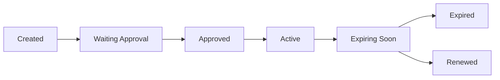
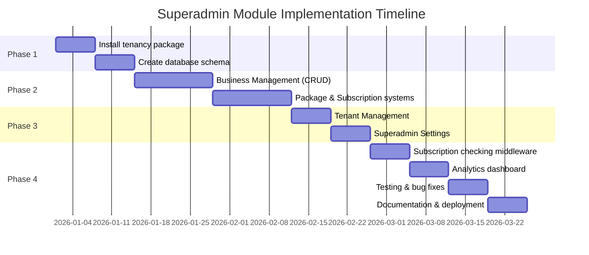

# 📊 Deep Analysis & Implementation Plan
## Superadmin Module for TewosHR ERP System


> 📝 **Analysis Scope**: This document provides a comprehensive comparison and implementation strategy based on three systems:
> - **TewosHR** (`D:\Tewos Technology\tewoshr`)
> - **Old ERP System** (`D:\Tewos Technology\erp.ettech.et`)
> - **Odoo** (Open-source reference)

---

## 📑 Table of Contents

- [I. Architectural Analysis](#i-architectural-analysis)
- [II. Key Implementation Concepts](#ii-key-implementation-concepts)
- [III. Detailed Implementation Plan](#iii-detailed-implementation-plan)
- [IV. Key Differences Comparison](#iv-key-differences-old-erp-vs-odoo-vs-recommended)
- [V. Implementation Roadmap](#v-implementation-roadmap)
- [VI. Critical Implementation Notes](#vi-critical-implementation-notes)
- [VII. Testing Strategy](#vii-testing-strategy)

---

## I. ARCHITECTURAL ANALYSIS

### 🎯 A. Current State Assessment

#### 1️⃣ **TewosHR** (Target System)
`Location: D:\Tewos Technology\tewoshr`

| Component | Details |
|-----------|---------|
| **Framework** | Laravel 11 with modular architecture (`nwidart/laravel-modules`) |
| **Current Modules** | 12 modules: Accounting, Contacts, CRM, Logistics, ProductCatalogue, Products, Project, Purchase, Roles, Sales, StockAdjustment, Whiteboard |
| **Architecture** | Single-tenant with `business_id` scoping |
| **Tech Stack** | PHP 8.2, Laravel 11, Livewire 3.5, MySQL |
| **Key Features** | Modern UI (Alpine.js, Tailwind-style), Spatie permissions, Media library |

#### 2️⃣ **Old ERP System** (Reference)
`Location: D:\Tewos Technology\erp.ettech.et`

**Superadmin Module Components:**

| Component | Description |
|-----------|-------------|
| **Business Management** | Multi-business management with activation control |
| **Tenant Management** | Basic tenant creation/deletion with database prefixing |
| **Package System** | Complex package management with 59+ permission flags |
| **Subscription System** | Time-based subscriptions with module activation |
| **Key Controllers** | `BusinessController` (2,227 lines), `PackagesController` (1,851 lines), `TenantManagementController`, `SuperadminSettingsController` |

#### 3️⃣ **Odoo Architecture** (Best Practices Reference)

| Feature | Implementation |
|---------|---------------|
| **Multi-Tenancy** | Database-per-tenant approach with centralized authentication |
| **Module System** | Highly modular with dependency management |
| **Subscription Model** | SaaS-ready with automated billing |
| **Company Hierarchy** | Multi-company support within tenants |

---

## II. KEY IMPLEMENTATION CONCEPTS

### 🏗️ A. Multi-Tenancy Strategy

**🎯 Recommended Approach for TewosHR: Hybrid Multi-Tenancy**

    ┌─────────────────────────────────────────────┐
    │         Central Database (Master)            │
    │  ┌─────────────────────────────────────┐    │
    │  │  - Tenants Table                     │    │
    │  │  - Packages Table                    │    │
    │  │  - Subscriptions Table               │    │
    │  │  - Superadmin Users                  │    │
    │  └─────────────────────────────────────┘    │
    └─────────────────────────────────────────────┘
                        ↓
        ┌──────────────┴──────────────┐
        │                              │
    ┌────▼─────┐              ┌────────▼────┐
    │ Tenant 1 │              │  Tenant 2   │
    │ Database │              │  Database   │
    │ (Full    │              │  (Full      │
    │  Schema) │              │   Schema)   │
    └──────────┘              └─────────────┘

**✅ Why This Approach?**

| Benefit | Description |
|---------|-------------|
| 🔒 **Data Isolation** | Complete separation per business (security & compliance) |
| 📈 **Scalability** | Easy to scale individual tenants |
| 🎨 **Customization** | Per-tenant schema modifications possible |
| 🌟 **Odoo-Inspired** | Similar to Odoo's db-filter approach |

---

## III. DETAILED IMPLEMENTATION PLAN

### 📦 Phase 1: Foundation Setup (Weeks 1-3)

#### 1.1 Install Multi-Tenancy Package

```bash
composer require stancl/tenancy
```

#### 1.2 Database Structure

**Central Database Tables:**

```sql
-- businesses (already exists, extend it)
    ALTER TABLE businesses ADD COLUMN tenant_id VARCHAR(255) UNIQUE;
    ALTER TABLE businesses ADD COLUMN subdomain VARCHAR(255) UNIQUE;
    ALTER TABLE businesses ADD COLUMN is_active TINYINT DEFAULT 1;
    ALTER TABLE businesses ADD COLUMN package_id INT UNSIGNED;
    ALTER TABLE businesses ADD COLUMN created_by INT UNSIGNED;

    -- packages
    CREATE TABLE packages (
        id BIGINT UNSIGNED AUTO_INCREMENT PRIMARY KEY,
        name VARCHAR(255) NOT NULL,
        description TEXT,
        price DECIMAL(22,4) DEFAULT 0,
        currency_id INT UNSIGNED,
        interval ENUM('days', 'months', 'years') DEFAULT 'months',
        interval_count INT DEFAULT 1,
        trial_days INT DEFAULT 0,

        -- Limits
        location_count INT DEFAULT 0,
        user_count INT DEFAULT 0,
        product_count INT DEFAULT 0,
        invoice_count INT DEFAULT 0,

        -- Module Permissions (JSON column for flexibility)
        custom_permissions JSON,

        -- Settings
        is_active TINYINT DEFAULT 1,
        is_private TINYINT DEFAULT 0,
        sort_order INT DEFAULT 0,

        created_at TIMESTAMP DEFAULT CURRENT_TIMESTAMP,
        updated_at TIMESTAMP DEFAULT CURRENT_TIMESTAMP ON UPDATE CURRENT_TIMESTAMP,
        deleted_at TIMESTAMP NULL
    );

    -- subscriptions
    CREATE TABLE subscriptions (
        id BIGINT UNSIGNED AUTO_INCREMENT PRIMARY KEY,
        business_id INT UNSIGNED NOT NULL,
        package_id INT UNSIGNED,

        start_date DATE,
        end_date DATE,

        -- Package snapshot at subscription time
        package_details JSON,

        -- Module activation tracking
        module_activation_details JSON,

        -- Pricing
        paid_via VARCHAR(255),
        payment_transaction_id VARCHAR(255),

        status ENUM('approved', 'waiting', 'declined') DEFAULT 'waiting',

        created_id INT UNSIGNED,
        created_at TIMESTAMP DEFAULT CURRENT_TIMESTAMP,
        updated_at TIMESTAMP DEFAULT CURRENT_TIMESTAMP ON UPDATE CURRENT_TIMESTAMP,
        deleted_at TIMESTAMP NULL,

        FOREIGN KEY (business_id) REFERENCES businesses(id) ON DELETE CASCADE,
        FOREIGN KEY (package_id) REFERENCES packages(id) ON DELETE SET NULL
    );

    -- tenants (for multi-tenancy)
    CREATE TABLE tenants (
        id VARCHAR(255) PRIMARY KEY,
        business_id INT UNSIGNED UNIQUE,
        data JSON,
        created_at TIMESTAMP DEFAULT CURRENT_TIMESTAMP,
        updated_at TIMESTAMP DEFAULT CURRENT_TIMESTAMP ON UPDATE CURRENT_TIMESTAMP
    );

    -- domains (for subdomain routing)
    CREATE TABLE domains (
        id BIGINT UNSIGNED AUTO_INCREMENT PRIMARY KEY,
        domain VARCHAR(255) UNIQUE NOT NULL,
        tenant_id VARCHAR(255) NOT NULL,
        created_at TIMESTAMP DEFAULT CURRENT_TIMESTAMP,
        updated_at TIMESTAMP DEFAULT CURRENT_TIMESTAMP ON UPDATE CURRENT_TIMESTAMP,

        FOREIGN KEY (tenant_id) REFERENCES tenants(id) ON DELETE CASCADE
    );
```

#### 1.3 Module Structure

```plaintext

    Modules/Superadmin/
    ├── app/
    │   ├── Http/
    │   │   ├── Controllers/
    │   │   │   ├── BusinessController.php
    │   │   │   ├── TenantManagementController.php
    │   │   │   ├── PackagesController.php
    │   │   │   ├── SubscriptionsController.php
    │   │   │   └── SuperadminSettingsController.php
    │   │   ├── Middleware/
    │   │   │   ├── SuperadminMiddleware.php
    │   │   │   └── CheckSubscriptionMiddleware.php
    │   │   └── Requests/
    │   │       ├── CreateBusinessRequest.php
    │   │       └── CreatePackageRequest.php
    │   ├── Models/
    │   │   ├── Business.php (extended)
    │   │   ├── Package.php
    │   │   ├── Subscription.php
    │   │   └── Tenant.php
    │   ├── Services/
    │   │   ├── TenantService.php
    │   │   ├── SubscriptionService.php
    │   │   └── PackageService.php
    │   └── Notifications/
    │       ├── SubscriptionExpiring.php
    │       └── NewBusinessWelcome.php
    ├── database/
    │   ├── migrations/
    │   └── seeders/
    ├── resources/
    │   └── views/
    │       ├── businesses/
    │       ├── packages/
    │       ├── subscriptions/
    │       └── tenants/
    └── routes/
        ├── web.php
        └── api.php
```

---

### 🚀 Phase 2: Core Superadmin Features (Weeks 4-6)

#### 2.1 Business Management

**Key Features to Implement:**

```php
// app/Http/Controllers/Superadmin/BusinessController.php

    class BusinessController extends Controller
    {
        public function index()
        {
            // List all businesses with:
            // - Active subscription status
            // - Package details
            // - User count, location count
            // - Last activity
            // - Revenue metrics
        }

        public function create()
        {
            // Create new business with:
            // - Owner details (auto-create user)
            // - Business information
            // - Initial location
            // - Package selection
            // - Default settings initialization
        }

        public function manage($id)
        {
            // Detailed business management:
            // - Custom package permissions override
            // - Module activation/deactivation
            // - Subscription history
            // - Usage analytics
            // - Custom pricing
        }

        public function toggleActive($id)
        {
            // Activate/Deactivate business access
        }
    }
```

**🔄 Critical Business Creation Flow** (from old ERP):

1. ✅ Create owner user
2. ✅ Create business record
3. ✅ Create tenant database
4. ✅ Migrate tenant schema
5. ✅ Seed default data (accounts, categories, taxes)
6. ✅ Create business location
7. ✅ Assign default permissions
8. ✅ Send welcome notification

---

#### 2.2 Package Management

**📋 Package Permission Categories** (based on old ERP analysis):

```php
// Package permissions structure
    [
        'modules' => [
            'manufacturing' => ['enabled' => true, 'price' => 50, 'interval' => 'month'],
            'accounting' => ['enabled' => true, 'price' => 100, 'interval' => 'month'],
            'hr' => ['enabled' => true, 'price' => 75, 'interval' => 'month'],
            'crm' => ['enabled' => true, 'price' => 60, 'interval' => 'month'],
            'petro' => ['enabled' => false, 'price' => 200, 'interval' => 'month'],
            'fleet' => ['enabled' => false, 'price' => 80, 'interval' => 'month'],
            // ... more modules
        ],

        'features' => [
            'multi_location' => true,
            'backup_module' => true,
            'sms_notifications' => true,
            'custom_reports' => false,
            // ... more features
        ],

        'limits' => [
            'users' => 10,
            'locations' => 3,
            'products' => 1000,
            'monthly_invoices' => 500,
        ],

        'integrations' => [
            'payment_gateways' => ['stripe', 'paypal'],
            'accounting_sync' => false,
        ]
    ]
```

**Package Controller Structure:**

```php
class PackagesController extends Controller
    {
        public function index()
        {
            // List packages with:
            // - Active subscribers count
            // - Monthly recurring revenue (MRR)
            // - Package visibility (public/private)
        }

        public function create()
        {
            // Package builder with:
            // - Module selection (checkboxes)
            // - Pricing per module
            // - Limit settings
            // - Trial period configuration
        }

        public function getModuleSubscriptions()
        {
            // DataTables: Show module-level subscriptions
            // Filter by status, date range, business
        }
    }
```

---

#### 2.3 Subscription System

**📊 Subscription Lifecycle:**



**Key Features:**

```php
class SubscriptionService
    {
        public function createSubscription($businessId, $packageId, $paymentDetails)
        {
            // 1. Get package details
            // 2. Calculate start/end dates
            // 3. Create subscription record
            // 4. Store payment info
            // 5. Update business permissions
            // 6. Send confirmation notification
        }

        public function checkModuleAccess($businessId, $moduleName)
        {
            // Real-time module access checking
            // Used in middleware
        }

        public function calculateModuleExpiry($businessId, $moduleName)
        {
            // Calculate individual module expiry
            // Based on activation data
        }

        public function handleExpiredSubscription($subscription)
        {
            // 1. Grace period (e.g., 7 days)
            // 2. Restrict access (read-only mode)
            // 3. Send reminder notifications
            // 4. Archive after X days
        }
    }
```

**🔒 Subscription Middleware** (Critical for security):

```php
// app/Http/Middleware/CheckSubscriptionMiddleware.php

    class CheckSubscriptionMiddleware
    {
        public function handle($request, Closure $next, $module = null)
        {
            $business = auth()->user()->business;
            $subscription = Subscription::active_subscription($business->id);

            if (!$subscription) {
                return redirect()->route('subscription.expired');
            }

            // Check module-specific access
            if ($module && !$this->hasModuleAccess($subscription, $module)) {
                abort(403, 'Module access denied');
            }

            // Check limits (users, products, etc.)
            if (!$this->withinLimits($subscription, $business)) {
                return redirect()->route('subscription.limit-exceeded');
            }

            return $next($request);
        }
    }
```

---

#### 2.4 Tenant Management

**Tenant Operations:**

```php
class TenantService
    {
        public function createTenant($businessData)
        {
            // 1. Generate tenant ID (subdomain)
            // 2. Create tenant record
            // 3. Create tenant database (with prefix)
            // 4. Run migrations on tenant DB
            // 5. Seed default data
            // 6. Create domain record
            // 7. Link to business

            // Example: business123.tewoshr.com → business123_erp_db
        }

        public function deleteTenant($tenantId)
        {
            // 1. Backup tenant data
            // 2. Remove domain records
            // 3. Delete tenant database
            // 4. Remove tenant record
            // 5. Archive business record
        }

        public function switchTenant($tenantId)
        {
            // For superadmin to access any tenant
            // Impersonate functionality
        }
    }
```

**Environment Configuration:**

```env
# .env additions
TENANT_DATABASE_PREFIX=tenant_
CENTRAL_DOMAIN=tewoshr.com
SUPERADMIN_EMAIL=admin@tewoshr.com
```

---

### ⚙️ Phase 3: Settings & Permissions (Weeks 7-8)

#### 3.1 Superadmin Settings

**Settings Categories:**

1. Application Settings
    •  Site name, logo, favicon
    •  Default currency, timezone, language
    •  Date/time formats

2. Business Registration
    •  Allow public registration (Yes/No)
    •  Auto-approve new businesses
    •  Default package for new businesses
    •  Email verification required

3. Payment Gateways
    •  Stripe (keys, webhook)
    •  PayPal (credentials)
    •  Razorpay, Paystack, etc.

4. Email/SMS Settings
    •  SMTP configuration
    •  SMS provider (Twilio, Vonage)
    •  Notification templates

5. Default Resources
    •  Default chart of accounts
    •  Default product categories
    •  Default tax rates
    •  Default notification templates

#### 3.2 Permission System

**Permission Levels:**

```plaintext
1. Superadmin Permissions (central)
   - manage_businesses
   - manage_packages
   - manage_subscriptions
   - manage_tenants
   - view_analytics
   - configure_system

2. Package Permissions (per subscription)
   - Module-level (enable/disable modules)
   - Feature-level (specific features within modules)
   - Limit-level (users, products, invoices)

3. User Permissions (per tenant)
   - Standard Laravel/Spatie permissions
   - Role-based access control (RBAC)
```

---

### 📈 Phase 4: Advanced Features (Weeks 9-12)

#### 4.1 Analytics Dashboard

**📊 Key Metrics:**

- 📈 Total businesses (active/inactive)
- 💰 Total revenue (MRR, ARR)
- 📦 Subscription distribution by package
- 📊 Module usage statistics
- 📉 Churn rate
- 💵 Average revenue per user (ARPU)

#### 4.2 Billing & Invoicing

```php
// Auto-generate invoices for subscriptions
// Payment reminders
// Failed payment handling
// Dunning management (retry logic)
```

#### 4.3 Module Marketplace (Future)

```php
// Install/uninstall modules per tenant
// Module versioning
// Automatic updates
// Compatibility checking
```

---

## IV. KEY DIFFERENCES: OLD ERP vs. ODOO vs. RECOMMENDED

| Feature | Old ERP (erp.ettech.et) | Odoo | ✅ Recommended for TewosHR |
|---------|-------------------------|------|----------------------------|
| **Multi-Tenancy** | Single DB with `business_id` | Database per tenant | **Hybrid: DB per tenant** |
| **Subscription Model** | Complex JSON in subscriptions table | Modular with dependencies | **Simplified JSON + limits** |
| **Module Management** | 59+ boolean flags | Dependency-based modules | **Laravel Modules package** |
| **Package Permissions** | Monolithic controller (2,227 lines) | Distributed across modules | **Service-based architecture** |
| **Tenant Isolation** | Soft (`business_id` scoping) | Hard (separate databases) | **Hard (separate databases)** |
| **UI/UX** | Legacy Blade templates | XML/JS framework | **Modern Livewire + Alpine** |

---

## V. IMPLEMENTATION ROADMAP



| Week | Task | Status |
|------|------|--------|
| 1-2  | Install tenancy package, create database schema | 🟡 Pending |
| 3-4  | Implement Business Management (CRUD) | 🟡 Pending |
| 5-6  | Implement Package & Subscription systems | 🟡 Pending |
| 7    | Implement Tenant Management | 🟡 Pending |
| 8    | Implement Superadmin Settings | 🟡 Pending |
| 9    | Build middleware for subscription checking | 🟡 Pending |
| 10   | Implement analytics dashboard | 🟡 Pending |
| 11   | Testing & bug fixes | 🟡 Pending |
| 12   | Documentation & deployment | 🟡 Pending |

---

## VI. CRITICAL IMPLEMENTATION NOTES

### 🔐 Security Considerations

| # | Consideration | Description |
|---|---------------|-------------|
| 1 | **Tenant Isolation** | Ensure no cross-tenant data leakage |
| 2 | **Superadmin Access** | Separate authentication for superadmin |
| 3 | **API Rate Limiting** | Per-tenant rate limits |
| 4 | **Data Encryption** | Encrypt sensitive subscription data |

### ⚡ Performance Optimization

| # | Strategy | Implementation |
|---|----------|----------------|
| 1 | **Database Connection Pooling** | For multi-tenant DB connections |
| 2 | **Caching** | Cache subscription status per tenant |
| 3 | **Queue Jobs** | Background jobs for tenant creation, migrations |
| 4 | **CDN** | Static assets via CDN |

### 📊 Scalability Planning

| Threshold | Action Required |
|-----------|-----------------|
| Tenant count > 1000 | **Database Sharding** |
| High traffic | **Load Balancing** (Multiple app servers) |
| Complex operations | **Microservices** (Extract billing, tenant management) |

---

## VII. TESTING STRATEGY

### ✅ Test Coverage

| Test Type | Scope | Priority |
|-----------|-------|----------|
| **Unit Tests** | Service classes, models | 🔴 High |
| **Feature Tests** | Controllers, middleware | 🔴 High |
| **Integration Tests** | Multi-tenancy flow, subscription lifecycle | 🟠 Medium |
| **Manual Testing** | Complete business creation flow, module activation | 🟢 Low |

---

## 🎯 Conclusion

This analysis provides a **production-ready roadmap** combining the best practices from:

- ✅ Your old ERP system (battle-tested features)
- ✅ Odoo's architecture (industry-standard patterns)
- ✅ Modern Laravel multi-tenancy patterns (latest technology)

> 💡 **Key Takeaway**: Start with a solid foundation (Phase 1) before building complex features. Focus on tenant isolation, subscription management, and scalable architecture from day one.

---

**📚 Additional Resources:**

- [Laravel Multi-Tenancy Package](https://tenancyforlaravel.com/)
- [Odoo Multi-Tenancy Documentation](https://www.odoo.com/documentation/)
- [Laravel Modules Package](https://nwidart.com/laravel-modules/)
- [Spatie Laravel Permission](https://spatie.be/docs/laravel-permission/)

---

**👥 Team Responsibilities:**

| Team Member | Module Responsibility |
|-------------|----------------------|
| Backend Lead | Tenant Management, Subscription Logic |
| Full-Stack Dev | Business Management, Package CRUD |
| Frontend Dev | Superadmin Dashboard, Analytics |
| DevOps | Database Setup, Multi-Tenancy Infrastructure |
| QA | Testing Strategy Implementation |

---

*Last Updated: January 1, 2026*  
*Version: 1.0*  
*Status: Planning Phase* 🟡